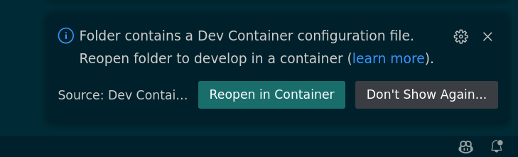
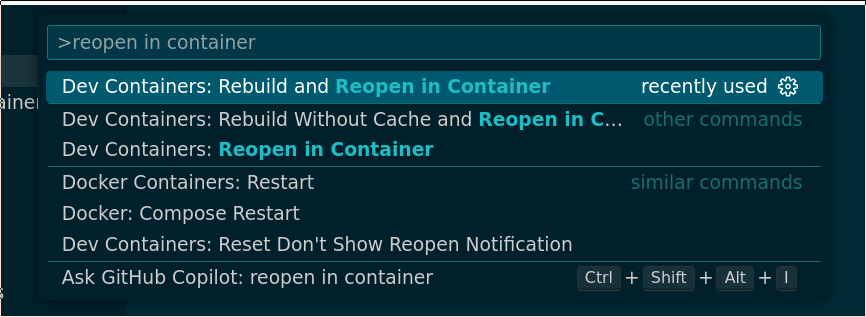
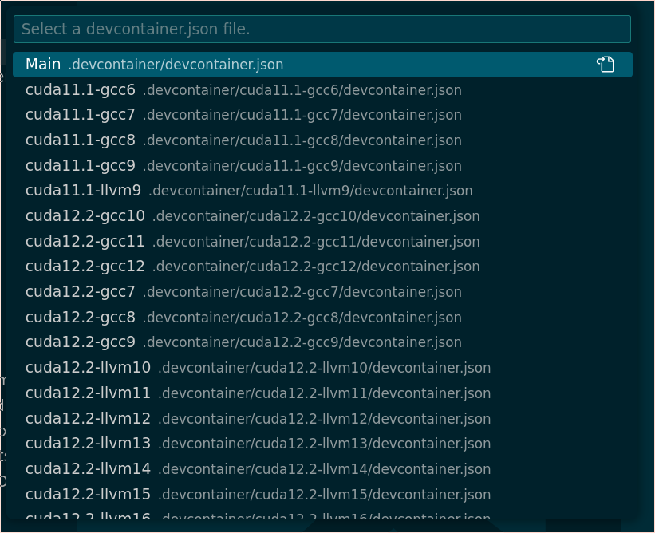
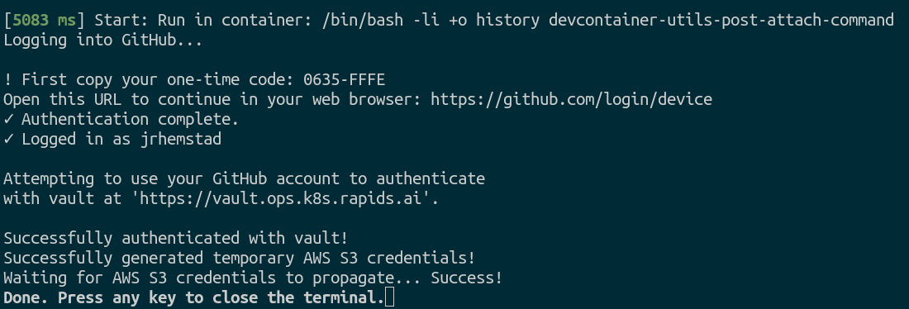
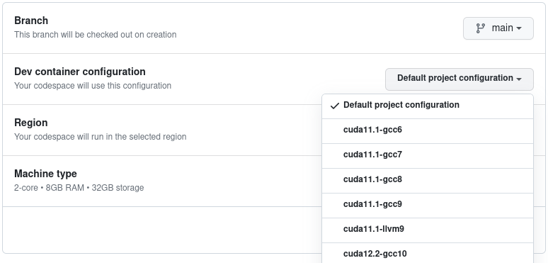

> **Note**
> The instructions in this README are specific to Linux development environments. Instructions for Windows are coming soon!

[](https://codespaces.new/NVIDIA/cccl?quickstart=1&devcontainer_path=.devcontainer%2Fdevcontainer.json)

# CCCL Dev Containers

CCCL uses [Development Containers](https://containers.dev/) to provide consistent and convenient development environments for both local development and for CI. This guide covers setup in [Visual Studio Code](#quickstart-vscode-recommended) and [Docker](#quickstart-docker-manual-approach). The guide also provides additional instructions in case you want use WSL.

## Table of Contents
1. [Quickstart: VSCode (Recommended)](#vscode)
2. [Quickstart: Docker (Manual Approach)](#docker)
3. [Quickstart: Using WSL](#wsl)

## Quickstart: VSCode (Recommended) <a name="vscode"></a>

### Prerequisites
- [Visual Studio Code](https://code.visualstudio.com/)
- [Remote - Containers extension](https://marketplace.visualstudio.com/items?itemName=ms-vscode-remote.remote-containers)
- [NVIDIA Container Toolkit](https://docs.nvidia.com/datacenter/cloud-native/container-toolkit/latest/install-guide.html)
- [Docker](https://docs.docker.com/engine/install/) - This is only for completeness because it should already be implicitly installed by the Dev Containers extension

### Steps

1. Clone the Repository
    ```bash
    git clone https://github.com/nvidia/cccl.git
    ```
2. Open the cloned directory in VSCode

3. Launch a Dev Container by clicking the prompt suggesting to "Reopen in Container"

   

   - Alternatively, use the Command Palette to start a Dev Container. Press `Ctrl+Shift+P` to open the Command Palette. Type "Remote-Containers: Reopen in Container" and select it.

     

4. Select an environment with the desired CTK and host compiler from the list:

   

5. VSCode will initialize the selected Dev Container. This can take a few minutes the first time.

6. Once initialized, the local `cccl/` directory is mirrored into the container to ensure any changes are persistent.

7. Done! See the [contributing guide](../CONTRIBUTING.md#building-and-testing) for instructions on how to build and run tests.

### (Optional) Authenticate with GitHub for `sccache`

After starting the container, there will be a prompt to authenticate with GitHub. This grants access to a [`sccache`](https://github.com/mozilla/sccache) server shared with CI and greatly accelerates local build times. This is currently limited to NVIDIA employees belonging to the `NVIDIA` or `rapidsai` GitHub organizations.

Without authentication to the remote server, `sccache` will still accelerate local builds by using a filesystem cache.

Follow the instructions in the prompt as below and enter the one-time code at https://github.com/login/device

  

To manually trigger this authentication, execute the `devcontainer-utils-vault-s3-init` script within the container.

For more information about the sccache configuration and authentication, see the documentation at [`rapidsai/devcontainers`](https://github.com/rapidsai/devcontainers/blob/branch-23.10/USAGE.md#build-caching-with-sccache).

## Quickstart: Docker (Manual Approach) <a name="docker"></a>

### Prerequisites
- [Docker](https://docs.docker.com/desktop/install/linux-install/)

### Steps
1. Clone the repository and use the [`launch.sh`](./launch.sh) script to launch the default container environment
    ```bash
    git clone https://github.com/nvidia/cccl.git
    cd cccl
    ./.devcontainer/launch.sh --docker
    ```
    This script starts an interactive shell as the `coder` user inside the container with the local `cccl/` directory mirrored into `/home/coder/cccl`.

    For specific environments, use the `--cuda` and `--host` options:
    ```bassh
    ./.devcontainer/launch.sh --docker --cuda 12.2 --host gcc10
    ```
    See `./.devcontainer/launch.sh --help` for more information.

2. Done. See the [contributing guide](../CONTRIBUTING.md#building-and-testing) for instructions on how to build and run tests.

## Available Environments

CCCL provides environments for both the oldest and newest supported CUDA versions with all compatible host compilers.

Look in the [`.devcontainer/`](.) directory to see the available configurations. The top-level [`devcontainer.json`](./devcontainer.json) serves as the default environment. All `devcontainer.json` files in the `cuda<CTK_VERSION>-<HOST-COMPILER>` sub-directories are variations on this top-level file, with different base images for the different CUDA and host compiler versions.

## VSCode Customization

By default, CCCL's Dev Containers come with certain VSCode settings and extensions configured by default, as can be seen in the [`devcontainer.json`](./devcontainer.json) file. This can be further customized by users without needing to modify the `devcontainer.json` file directly.

For extensions, the [`dev.containers.defaultExtensions` setting](https://code.visualstudio.com/docs/devcontainers/containers#_always-installed-extensions) allows listing extensions that will always be installed.

For more general customizations, VSCode allows using a dotfile repository. See the [VSCode documentation](https://code.visualstudio.com/docs/devcontainers/containers#_personalizing-with-dotfile-repositories) for more information.

## GitHub Codespaces

[](https://codespaces.new/NVIDIA/cccl?quickstart=1&devcontainer_path=.devcontainer%2Fdevcontainer.json)

One of the benefits of Dev Containers is that they integrate natively with [GitHub Codespaces](https://github.com/features/codespaces). Codespaces provide a VSCode development environment right in your browser running on a machine in the cloud. This provides a truly one-click, turnkey development environment where you can develop, build, and test with no other setup required.

Click the badge above or [click here](https://codespaces.new/NVIDIA/cccl?quickstart=1&devcontainer_path=.devcontainer%2Fdevcontainer.json) to get started with CCCL's Dev Containers on Codespaces. This will start the default Dev Container environment. [Click here](https://github.com/codespaces/new?hide_repo_select=true&ref=main&repo=296416761&skip_quickstart=true) to start a Codespace with a particular environment and hardware configuration as shown:

   

## For Maintainers: The `make_devcontainers.sh` Script

### Overview

[`make_devcontainers.sh`](./make_devcontainers.sh) generates devcontainer configurations for the unique combinations of CUDA Toolkit (CTK) versions and host compilers in [`ci/matrix.yaml`](../ci/matrix.yaml).

### How It Works:

1. Parses the matrix from `ci/matrix.yaml`.
2. Use the top-level [`.devcontainer/devcontainer.json`](./devcontainer.json) as a template. For each unique combination of CTK version and host compiler, generate a corresponding `devcontainer.json` configuration, adjusting only the base Docker image to match the desired environment.
3. Place the generated configurations in the `.devcontainer` directory, organizing them into subdirectories following the naming convention `cuda<CTK_VERSION>-<COMPILER_VERSION>`.

For more information, see the `.devcontainer/make_devcontainers.sh --help` message.

**Note**: When adding or updating supported environments, modify `matrix.yaml` and then rerun this script to synchronize the `devcontainer` configurations.

## Quickstart: Using WSL <a name="wsl"></a>

> [!NOTE]
> _Make sure you have the Nvidia driver installed on your Windows host before moving further_. Type in `nvidia-smi` for verification.

### Install WSL on your Windows host

> [!WARNING]
> Disclaimer: This guide was developed for WSL 2 on Windows 11.

1. Launch a Windows terminal (_e.g. Powershell_) as an administrator.

2. Install WSL 2 by running:
```bash
wsl --install 
```
This should probably install Ubuntu distro as a default.

3. Restart your computer and run `wsl -l -v` on a Windows terminal to verify installation.

<h3 id="prereqs"> Install prerequisites and VS Code extensions</h3>

4. Launch your WSL/Ubuntu terminal by running `wsl` in Powershell.

5. Install the [WSL extension](ms-vscode-remote.remote-wsl) on VS Code.

    - `Ctrl + Shift + P` and select `WSL: Connect to WSL` (it will prompt you to install the WSL extension).

    - Make sure you are connected to WSL with VS Code by checking the bottom left corner of the VS Code window (should indicate "WSL: Ubuntu" in our case).

6. Install the [Dev Containers extension](ms-vscode-remote.remote-containers) on VS Code.

    - In a vanilla system you should be prompted to install `Docker` at this point, accept it. If it hangs you might have to restart VS Code after that.

7. Install the [NVIDIA Container Toolkit](https://docs.nvidia.com/datacenter/cloud-native/container-toolkit/latest/install-guide.html). **Make sure you install the WSL 2 version and not the native Linux one**. This builds on top of Docker so make sure you have Docker properly installed (run `docker --version`).

8. Open `/etc/docker/daemon.json` from within your WSL system (if the file does not exist, create it) and add the following:

```json
{
    "runtimes": {
        "nvidia": {
            "path": "nvidia-container-runtime",
            "runtimeArgs": []
        }
    }
}
```

then run `sudo systemctl restart docker.service`.

---
### Build CCCL in WSL using Dev Containers

9. Still on your WSL terminal run `git clone https://github.com/NVIDIA/cccl.git`


10. Open the CCCL cloned repo in VS Code ( `Ctrl + Shift + P `, select `File: Open Folder...` and select the path where your CCCL clone is located).

11. If prompted, choose `Reopen in Container`.
    
    - If you are not prompted just type `Ctrl + Shift + P` and `Dev Containers: Open Folder in Container ...`.

12. Verify that Dev Container was configured properly by running `nvidia-smi` in your Dev Container terminal. For a proper configuration it is important for the steps in [Install prerequisites and VS Code extensions](#prereqs) to be followed in a precise order.

From that point on, the guide aligns with our [existing Dev Containers native Linux guide](https://github.com/NVIDIA/cccl/blob/main/.devcontainer/README.md) with just one minor potential alteration:

13. If WSL was launched without the X-server enabled, when asked to "authenticate Git with your Github credentials", if you answer **Yes**, the browser might not open automatically, with the following error message. 

> Failed opening a web browser at https://github.com/login/device
  exec: "xdg-open,x-www-browser,www-browser,wslview": executable file not found in $PATH
  Please try entering the URL in your browser manually

In that case type in the address manually in your web browser https://github.com/login/device and fill in the one-time code.
