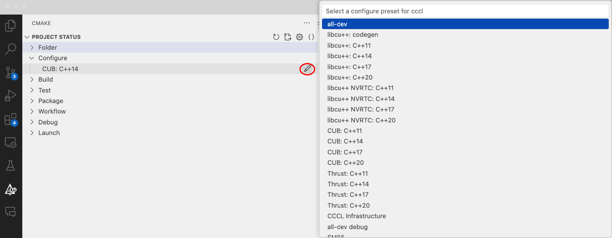
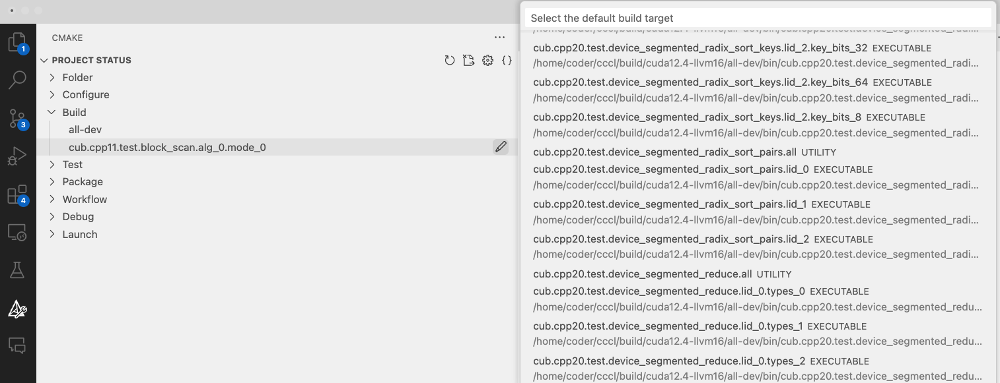
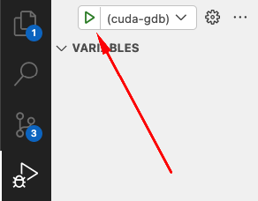

# Contributing to CCCL

Thank you for your interest in contributing to the CUDA Core Compute Libraries (CCCL)!

Looking for ideas for your first contribution? Check out: 


## Getting Started

1. **Fork & Clone the Repository**:

   Fork the [CCCL GitHub Repository](https://github.com/nvidia/cccl) and clone the fork. For more information, check [GitHub's documentation on forking](https://docs.github.com/en/github/getting-started-with-github/fork-a-repo) and [cloning a repository](https://docs.github.com/en/github/creating-cloning-and-archiving-repositories/cloning-a-repository).

2. **Set up Development Environment**:

   CCCL uses Development Containers to provide a consistent development environment for both local development and CI. Contributors are strongly encouraged to use these containers as they simplify environment setup. See the [Dev Containers guide](.devcontainer/README.md) for instructions on how to quickly get up and running using dev containers with or without VSCode.

## Making Changes

1. **Create a New Branch**:

   ```bash
   git checkout -b your-feature-branch
   ```

2. **Make Changes**.

3. **Build and Test**:

   Ensure changes don't break existing functionality by building and running tests.

   ```bash
   ./ci/build_[thrust|cub|libcudacxx].sh -cxx <HOST_COMPILER> -std <CXX_STANDARD> -arch <GPU_ARCHS>
   ./ci/test_[thrust|cub|libcudacxx].sh  -cxx <HOST_COMPILER> -std <CXX_STANDARD> -arch <GPU_ARCHS>
   ```

   For more details on building and testing, refer to the [Building and Testing](#building-and-testing) section below.

4. **Commit Changes**:

   ```bash
   git commit -m "Brief description of the change"
   ```

### Developer Guides

For more information about design and development practices for each CCCL component, refer to the following developer guides:

#### CUB

- [CUB Developer Guide](docs/cub/developer_overview.rst) - General overview of the design of CUB internals
- [CUB Test Overview](docs/cub/test_overview.rst) - Overview of how to write CUB unit tests
- [CUB Tuning Infrastructure](docs/cub/tuning.rst) - Overview of CUB's performance tuning infrastructure
- [CUB Benchmarks](docs/cub/benchmarking.rst) - Overview of CUB's performance benchmarks

#### Thrust

Coming soon!

#### libcudacxx

Coming soon!

## Building and Testing

CCCL components are header-only libraries. This means there isn't a traditional build process for the library itself. However, before submitting contributions, it's a good idea to [build and run tests](#developer-guides).

There are multiple options for building and running our tests. Which option you choose depends on your preferences and whether you are using [CCCL's DevContainers](.devcontainer/README.md) (highly recommended!).

### Using Manual Build Scripts

#### Building

Use the build scripts provided in the `ci/` directory to build tests for each component. Building tests does not require a GPU.

```bash
   ci/build_[thrust|cub|libcudacxx].sh -cxx <HOST_COMPILER> -std <CXX_STANDARD> -arch <GPU_ARCHS>

- **HOST_COMPILER**: The desired host compiler (e.g., `g++`, `clang++`).
- **CXX_STANDARD**: The C++ standard version (e.g., `11`, `14`, `17`, `20`).
- **GPU_ARCHS**: A semicolon-separated list of CUDA GPU architectures (e.g., `"70;85;90"`). This uses the same syntax as CMake's [CUDA_ARCHITECTURES](https://cmake.org/cmake/help/latest/prop_tgt/CUDA_ARCHITECTURES.html#prop_tgt:CUDA_ARCHITECTURES):
   - `70` - both PTX and SASS
   - `70-real` - SASS only
   - `70-virtual` - PTX only

**Example:**
```bash
./ci/build_cub.sh -cxx g++ -std 14 -arch "70;75;80-virtual"
```

#### Testing

Use the test scripts provided in the `ci/` directory to run tests for each component. These take the same arguments as the build scripts and will automatically build the tests if they haven't already been built. Running tests requires a GPU.

```bash
   ci/test_[thrust|cub|libcudacxx].sh -cxx <HOST_COMPILER> -std <CXX_STANDARD> -arch <GPU_ARCHS>
```

**Example:**

```bash
./ci/test_cub.sh -cxx g++ -std 14 -arch "70;75;80-virtual"
```

### Using CMake Presets

[CMake Presets](https://cmake.org/cmake/help/latest/manual/cmake-presets.7.html) are a set of configurations defined in a JSON file that specify project-wide build details for CMake. They provide a standardized and sharable way to configure, build, and test projects across different platforms and development environments. Presets are available from CMake versions 3.19 and later.

There are three kinds of Presets

- Configure Presets: specify options for the `cmake` command,

- Build Presets: specify options for the `cmake --build` command,

- Test Presets: specify options for the `ctest` command.

In CCCL we provide many presets to be used out of the box. You can find the complete list in our corresponding [CMakePresets.json](./CMakePresets.json) file.

These commands can be used to get lists of the configure, build, and test presets.

```bash
cmake --list-presets # Configure presets
cmake --build --list-presets # Build presets
ctest --list-presets # Test presets
```

While there is a lot of overlap, there may be differences between the configure, build, and test presets to support various testing workflows.

The `dev` presets are intended as a base for general development while the others are useful for replicating CI failures.

#### Using CMake Presets via Command Line

CMake automatically generates the preset build directories. You can configure, build and test for a specific preset (e.g. `thrust-cpp11`) via cmake from the root directory by appending `--preset=thrust-cpp11` to the corresponding commands. For example:

```bash
cmake --preset=thrust-cpp11
cmake --build --preset=thrust-cpp11
ctest --preset=thrust-cpp11
```

That will create `build/<optional devcontainer name>/thrust-cpp11/` and build everything in there. The devcontainer name is inserted automatically on devcontainer builds to keep build artifacts separate for the different toolchains.

It's also worth mentioning that additional cmake options can still be passed in and will override the preset settings.

As a common example, the presets are currently always `60;70;80` for `CMAKE_CUDA_ARCHITECTURES`, but this can be overridden at configure time with something like:

```bash
cmake --preset=thrust-cpp20 "-DCMAKE_CUDA_ARCHITECTURES=89"
```

> **Note**: Either using the `cmake` command from within the root directory or from within the build directory works, but will behave in slightly different ways. Building and running tests from the build directory will compile every target and run all of the tests configured in the configure step. Doing so from the root directory using the `--preset=<test_preset>` option will build and run a subset of configured targets and tests.

#### Using CMake Presets via VS Code GUI extension (Recommended when using DevContainers)

The recommended way to use CMake Presets is via the VS Code extension [CMake Tools](https://marketplace.visualstudio.com/items?itemName=ms-vscode.cmake-tools), already included in [CCCL's DevContainers](.devcontainer/README.md). As soon as you install the extension you would be able to see the sidebar menu below.

   

You can specify the desired CMake Preset by clicking the "Select Configure Preset" button under the "Configure" node (see image below).

   

After that you can select the default build target from the "Build" node. As soon as you expand it, a list will appear with all the available targets that are included within the preset you selected. For example if you had selected the `all-dev` preset VS Code will display all the available targets we have in cccl.

   

You can build the selected target by pressing the gear button  at the bottom of the VS Code window.

Alternatively you can select the desired target from either the "Debug" or "Launch" drop down menu (for debugging or running correspondingly). <b>In that case after you select the target and either press "Run"  or "Debug"  the target will build on its own before running without the user having to build it explicitly from the gear button.</b>

---

We encourage users who want to debug device code to install the [Nsight Visual Studio Code Edition extension](https://marketplace.visualstudio.com/items?itemName=NVIDIA.nsight-vscode-edition) that enables the VS Code frontend for `cuda-gdb`. <u>To use it you should launch from the sidebar menu instead of pressing the "Debug" button from the bottom menu</u>.



## Creating a Pull Request

1. Push changes to your fork
2. Create a pull request targeting the `main` branch of the original CCCL repository. Refer to [GitHub's documentation](https://docs.github.com/en/github/collaborating-with-pull-requests/proposing-changes-to-your-work-with-pull-requests/about-pull-requests) for more information on creating a pull request.
3. Describe the purpose and context of the changes in the pull request description.

## Code Formatting (pre-commit hooks)

CCCL uses [pre-commit](https://pre-commit.com/) to execute all code linters and formatters. These
tools ensure a consistent coding style throughout the project. Using pre-commit ensures that linter
versions and options are aligned for all developers. Additionally, there is a CI check in place to
enforce that committed code follows our standards.

The linters used by CCCL are listed in `.pre-commit-config.yaml`.
For example, C++ and CUDA code is formatted with [`clang-format`](https://clang.llvm.org/docs/ClangFormat.html).

To use `pre-commit`, install via `conda` or `pip`:

```bash
conda config --add channels conda-forge
conda install pre-commit
```

```bash
pip install pre-commit
```

Then run pre-commit hooks before committing code:

```bash
pre-commit run
```

By default, pre-commit runs on staged files (only changes and additions that will be committed).
To run pre-commit checks on all files, execute:

```bash
pre-commit run --all-files
```

Optionally, you may set up the pre-commit hooks to run automatically when you make a git commit. This can be done by running:

```bash
pre-commit install
```

Now code linters and formatters will be run each time you commit changes.

You can skip these checks with `git commit --no-verify` or with the short version `git commit -n`.

## Continuous Integration (CI)

CCCL's CI pipeline tests across various CUDA versions, compilers, and GPU architectures.
For external contributors, the CI pipeline will not begin until a maintainer leaves an `/ok to test` comment. For members of the NVIDIA GitHub enterprise, the CI pipeline will begin immediately.
For a detailed overview of CCCL's CI, see [ci-overview.md](ci-overview.md).

There is a CI check for pre-commit, called [pre-commit.ci](pre-commit.ci).
This enforces that all linters (such as `clang-format`) pass.
If pre-commit.ci is failing, you can comment `pre-commit.ci autofix` on a pull request to trigger the auto-fixer.
The auto-fixer will push a commit to your pull request that applies changes made by pre-commit hooks.

## Review Process

Once submitted, maintainers will be automatically assigned to review the pull request. They might suggest changes or improvements. Constructive feedback is a part of the collaborative process, aimed at ensuring the highest quality code.

For constructive feedback and effective communication during reviews, we recommend following [Conventional Comments](https://conventionalcomments.org/).

Further recommended reading for successful PR reviews:

- [How to Do Code Reviews Like a Human (Part One)](https://mtlynch.io/human-code-reviews-1/)
- [How to Do Code Reviews Like a Human (Part Two)](https://mtlynch.io/human-code-reviews-2/)

## Thank You

Your contributions enhance CCCL for the entire community. We appreciate your effort and collaboration!
