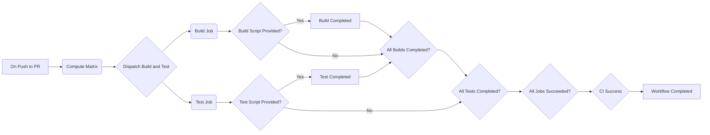

## CI Pipeline Overview

Welcome to the CI pipeline for CCCL! In this document, we will provide you with a high-level overview of the Continuous Integration (CI) process using GitHub Actions. The CI pipeline helps us automate the building, testing, and validation of our project to ensure its quality and stability.

### Workflow Structure

Our CI pipeline consists of multiple workflows, each serving a specific purpose. Let's go through each of them:

#### [pr.yml](.github/workflows/pr.yml)

This workflow runs on every pull request and push to the `main` branch. It orchestrates the entire CI process and includes the following jobs:

- [`compute-matrix`](#compute-matrix-yml): Reads the matrix configuration from the `matrix.yaml` file and computes the necessary build configurations based on the PR or push event.
- `thrust`, `cub`, and `libcudacxx`: Build and test jobs for each CCCL component. They are executed in parallel for each configuration specified in the matrix. These jobs are optional and depend on the presence of the corresponding build and test scripts.
- `ci`: A final job that runs after all other jobs and performs branch protection status checks.

#### [compute-matrix.yml](.github/workflows/compute-matrix.yml)

The matrix configuration defines the various combinations of build configurations we want to test. It is specified in the `matrix.yaml` file. The configurations include:

- `cuda`: The CUDA Toolkit version.
- `os`: The operating system.
- `cpu`: The CPU architecture.
- `compiler`: The compiler to use, including its name, version, and executable.
- `gpu_build_archs`: The GPU architectures to build for, separated by semicolons.
- `std`: The C++ standards to build for. Each value generates an independent build/test job.

The `compute-matrix.yml` workflow reads this matrix configuration and computes the necessary combinations based on the matrix type (e.g., "pull-request"). The computed matrix is used by other workflows to determine the configurations to build and test.

#### [dispatch-build-and-test.yml](#dispatch-build-and-test-yml)

This workflow is called by the `thrust`, `cub`, and `libcudacxx` jobs from the [`pr.yml`](#pr.yml) workflow. It dispatches the [`build-and-test.yml`](#build-and-test.yml) workflow for each specific build configuration in parallel. It includes the following job:

- `build_and_test`: Dispatches the `build-and-test.yml` workflow for each configuration. It provides the necessary inputs, such as the compiler, CUDA version, and build/test scripts, to the dispatched workflow.

Dispatching the `build-and-test.yml` workflow for each specific configuration allows us to execute the build and test steps concurrently. This parallel execution reduces the overall execution time and improves the efficiency of our CI pipeline.
#### [build-and-test.yml](.github/workflows/build-and-test.yml)

This reusable workflow is called by the `thrust`, `cub`, and `libcudacxx` jobs from the `pr.yml` workflow. It contains two main jobs:

- `build`: Builds the project using the specified build script and the given compiler, CUDA version, and other build configurations. This job is optional and depends on the presence of the build script.
- `test`: Runs the tests using the specified test script and the same configurations as the build job. This job is optional and depends on the presence of the test script.
