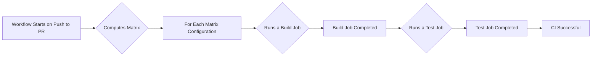

# CCCL - Continuous Integration (CI) Workflow 
As a header-only C++ library, the code we write isn't compiled until a developer includes it in their project. 

This means our code needs to be robust enough to compile and run across a variety of platforms, compilers, and configurations. 
As such, maintaining extensive and thorough Continuous Integration (CI) coverage is crucial. 

Our CI system needs to test various combinations of operating systems, CPU architectures, compilers, and C++ standards. 
The number of configurations can be quite large and hence our CI system must be designed to handle this complexity. 
We use GitHub Actions for this purpose. It is flexible, powerful, and well-integrated with GitHub.

This document will walk you through our CI workflow and guide you on how to interact with and troubleshoot it when needed.

## TL;DR - Workflow Overview

This repository relies on a GitHub Actions-based Continuous Integration (CI) workflow. Here's what you need to know:

- **Trigger:** The main workflow triggers on every push to the main branch or pull request (PR).
- **Execution:** The workflow generates a matrix of build configurations, based on the settings in matrix.yml, and then dispatches separate build and test jobs for each configuration. 
- **Failures:** If a job fails, you'll be notified through GitHub's interface. You can then check the logs for details.
- **Recovery:** To handle job failures, pull the relevant container image and rerun the script locally to reproduce the issue.

## The Matrix

The matrix defined in the [`matrix.yml`](ci/matrix.yaml) is the single source of truth for the environments we test our code against.
It dictates the build configurations, such as CUDA version, operating system, CPU architecture, compiler, GPU architectures, and C++ standards. 
It allows us to test our code against different combinations of these variables to ensure our code's compatibility and stability. 

## Lifecycle of a Pull Request

From creation to merging, a pull request in this project follows these steps:

1. Create a PR: Once you make a change, open a PR. 
  - If you have write permission to the repository, CI workflow will automatically start.
  - If you don't have write permission, the workflow will start once a maintainer comments on the PR with `/ok to test`. This comment is required for all subsequent workflow runs.
2. Wait for results: GitHub Actions executes the defined CI workflow, running jobs based on the matrix configuration.
3. Interpret results: Check the status of the workflow. If it passes, all tests have passed on all defined configurations, and your changes likely didn't break anything. 
4. Handle failures: If any job fails, the logs will provide information on what went wrong. 
5. Rerun jobs: If the failure seems unrelated to your changes (e.g., due to a temporary external issue), you can rerun the jobs.

## Troubleshooting Guide

If a CI job fails, here's what you can do to troubleshoot:

1. Check the logs: The logs provide detailed information on what went wrong during the execution. This is your starting point.
2. Reproduce the issue locally: Pull the relevant container image and rerun the script that failed. This will allow you to dig into the issue in depth.
3. Fix the issue: Once you've identified the problem, you can make appropriate changes to your code and rerun the CI jobs.

You can refer to [GitHub Actions documentation](https://docs.github.com/en/actions) for a deeper understanding of the process and the [GitHub Actions workflows syntax](https://docs.github.com/en/actions/reference/workflow-syntax-for-github-actions) to comprehend the workflow files' structure and syntax.

You're not in this alone - the community is here to help. If you're stuck, don't hesitate to raise an issue or ask for assistance. Open source thrives on collaboration and learning. Happy coding!

