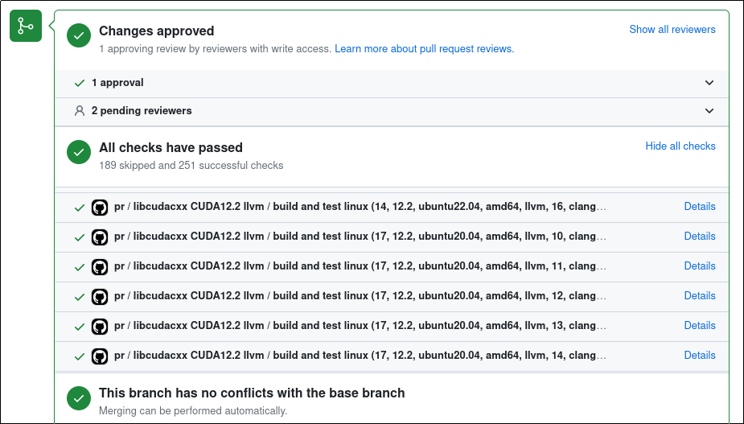
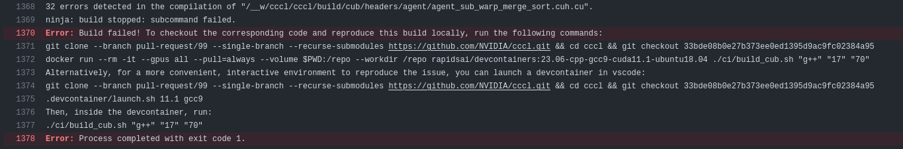

# Continuous Integration (CI) Overview for CCCL

The Continuous Integration (CI) process for CCCL ensures code quality and compatibility across various environments. This document provides an in-depth overview of the CI setup and workflows, enabling contributors to understand, debug, and reproduce CI checks locally.

## CI Environment and Configuration

### Development Containers

CCCL's CI jobs use the same Development Containers as described in the [Dev Container setup](.devcontainer/README.md). Follow the instructions in that guide to set up a development container with the same environment as CI.

### Matrix Testing
To ensure compatibility across various setups, CI tests are performed across a broad matrix of:

- CUDA versions
- Compilers
- GPU architectures
- Operating systems

The exact combinations of these environments are defined in the [`ci/matrix.yaml`](ci/matrix.yaml) file.

### Viewing CI Workflow Results

The results of every job in the CI pipeline are summarized on the bottom of the PR page. Click the "Details" link next to each run to provide more detailed information.

.

### Special CI Commands

Special commands can be included in the most recent commit message to control which jobs are spawned for the next pull-request CI run.
These commands can be combined with the [override matrix](#temporarily-overriding-the-pull-request-matrix) for even more fine-grained control.

- `[skip-<component>]`: Skips a subset of the CI jobs. These commands will block the PR from being merged while present in the last commit message of the branch. Recognized components are:
  - `[skip-matrix]`: Skip all build and test jobs specified in `ci/matrix.yaml`.
  - `[skip-vdc]`: Skip all "Validate Devcontainer" jobs.
  - `[skip-docs]`: Skip the documentation verification build.
  - `[skip-rapids]`: Skip all RAPIDS canary builds.
  - `[skip-matx]`: Skip all MatX canary builds.
  - **Example:** `git commit -m "Fix RAPIDS failures [skip-matrix][skip-vdc][skip-docs][skip-matx]"`

- `[workflow:<workflow>]`:  Execute jobs from the named workflow. Example: `[workflow:nightly]` runs all jobs defined in `matrix.yaml`'s `workflows.nightly` list.

### Temporarily Overriding the Pull Request Matrix

If a non-empty workflow named `override` exists in the `ci/matrix.yaml` file, this matrix will be used for pull requests instead of the `pull_request` matrix.
This is useful for reducing resource usage and turn-around time when a full run is not needed, for example:

- Testing changes that only apply to a specific compiler, OS, etc.
- Testing fixes to nightly CI failures by only running the nightly jobs that failed.
- Testing changes to CI infrastructure that only require a few jobs to run.

The PR will be blocked from merging until the override matrix is removed, ensuring that the full CI suite runs before landing the PR.
The override matrix can be combined with the `[skip-<...>]` commands detailed in [Special CI Commands](#special-ci-commands) to reduce unnecessary resource usage even further.

Example:

```
workflows:
  override:
    - {jobs: ['build'], project: 'cudax', ctk: '12.0', std: 'all', cxx: ['msvc14.39', 'gcc10', 'clang14']}
  pull_request:
    - <...>
```

### Accelerating Build Times with `sccache`

CCCL's CI uses [`sccache`](https://github.com/mozilla/sccache) to cache compiler artifacts for files that haven't changed and dramatically accelerate build times. Local builds inside [CCCL's Dev Containers](.devcontainer/README.md) can share the same cache such that local builds and CI jobs mutually benefit from accelerated build times. Follow the [GitHub Authentication](.devcontainer/README.md#optional-authenticate-with-github-for-sccache) guide to enable this feature.

### Build and Test Scripts

CI jobs employ the build and test scripts in the `ci/` directory to build and run tests. These scripts provide a consistent entry point for building and testing in both local and CI environments. For more information on using these scripts, see the [CONTRIBUTING.md guide](CONTRIBUTING.md#building-and-testing).

### Reproducing CI Failures Locally

If a pull request encounters a failure during CI testing, it is usually helpful to reproduce the issue locally to diagnose and fix it. Here is a step-by-step guide to recreate the exact environment and situation:

1. **Get the Appropriate Development Container**:

    CI jobs use the same [development containers](.devcontainer/README) as those used for local development.

    In order to simplify reproducing an issue in CI, it is recommended to use the same container locally. The CI logs will mention the exact environment used.

2. **Run the Build/Test Script**:

    CI jobs use the build and test scripts found in the `ci/` directory.

    Example:
    ```bash
    ./ci/build_cub.sh <HOST_COMPILER> <CXX_STANDARD> <GPU_ARCHS>
    ./ci/test_cub.sh <HOST_COMPILER> <CXX_STANDARD> <GPU_ARCHS>
    ```

    The CI logs provide exact instructions on the scripts and parameters used.

    Here is an example of a CI failure message that includes instructions how to clone the exact same commit and run the relevant script in the appropriate container. Note that the instructions may have changed. Refer to the latest failure log for the most up-to-date instructions.
    .

## CI Workflow Details

### Triggering Mechanism and `copy-pr-bot`

CCCL uses [NVIDIA's self-hosted action runners](https://docs.gha-runners.nvidia.com/runners/) for CI jobs. For security, PR workflows are triggered using the [`copy-pr-bot` GitHub application](https://docs.gha-runners.nvidia.com/onboarding/), which copies code to a prefixed branch to ensure only vetted code runs on the runners.

The CI pipeline will not start automatically for external contributors. A repository member will first review the changes and initiate the CI pipeline with an `/ok to test [commit SHA]` comment.

### SSH Signing Keys

[Signed commits](https://docs.github.com/en/authentication/managing-commit-signature-verification/signing-commits) are required for any internal NVIDIA contributors who want the convenience of CI running automatically whenever a commit is pushed to a branch (i.e., doesn't require using `/ok to test`).

This is not required for external contributions, which will always require an explicit `/ok to test [commit SHA]` comment from an approved account for each CI run.

To enable commit signing using your existing ssh key, set the following git options:

```bash
git config --global gpg.format ssh
git config --global user.signingKey ~/.ssh/YOUR_PUBLIC_KEY_FILE_HERE.pub

# These settings are optional. They tell git to automatically sign all new commits and tags.
# If these are set to false, use `git commit -S` to manually sign each commit.
git config --global commit.gpgsign true
git config --global tag.gpgsign true
```

Git is now configured to sign commits with your ssh key.

To complete the process, upload the public key to your [Github Signing Keys](https://github.com/settings/keys) in your browser or using the `gh` CLI tool:

```
gh ssh-key add ~/.ssh/YOUR_PUBLIC_KEY_FILE_HERE.pub --type signing
```

Make sure that the key is uploaded to 'Signing Keys', not just 'Authentication Keys'.
The same key may be used for both.

## Troubleshooting CI Failures

1. **Review CI logs**: Examine CI logs for specific error messages (see [Viewing CI Workflow Results](#viewing-ci-workflow-results))
2. **Reproduce Locally**: Try replicating the issue locally (see [Reproducing CI Failures Locally](#reproducing-ci-failures-locally))
3. **Ask for Assistance**: If stuck, don't hesitate to reach out to the @NVIDIA/cccl team on an issue or PR, or ask a question by starting a [Discussion](https://github.com/NVIDIA/cccl/discussions).
