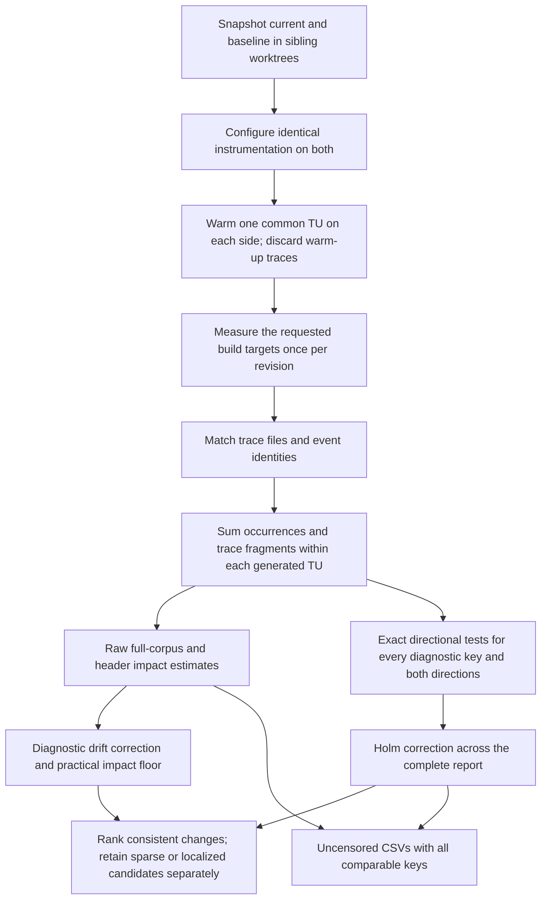

# Compile-time impact and directional consistency

## Measurements and scope

Every result is derived deterministically from the initial baseline/current
build pair. There are no follow-up compilations, sampled event occurrences,
bootstrap draws, time budgets, or partially completed confirmation experiments.
Serial and parallel trace parsing produce the same numerical results.



The headline is `sum(C_i) - sum(B_i)` for the complete **matched** TU trace
corpus. A header's raw impact is the corresponding difference in its selected
inclusive/exclusive costs. These are observed point estimates, not confidence
intervals or causal estimates. They sum compiler trace durations, rather than
elapsed time for a parallel build. Unmatched files are excluded and warned
about. Only identities present on both sides of a matched trace are compared;
unmatched nested work remains part of its matched parent's cost.

## Why occurrences are exposure, not replications

For header `h` in matched TU `i`, let `B_hi` and `C_hi` be its summed selected
costs, and `n_hi` its baseline occurrence count. All occurrences and trace
fragments from the same generated TU are combined before calculating spread or
testing. A TU with 1,000 inclusions supplies one direction observation, not
1,000 independent trials. Header-test configurations sharing the same generated
input are also combined by the existing TU identity normalization.

For equal occurrence counts, mean change times count is exactly summed change.
It preserves build impact but does not correct noise. Subtracting per-side
per-occurrence averages would additionally hide an increase in inclusions with
unchanged cost per inclusion. For example, 24 TUs changing from one 0.1 s
inclusion to two 0.1 s inclusions have +2.4 s total impact despite unchanged
per-side averages. The report retains this impact and both counts.

Inner observations share compilation state. Treating them as replications
inflates statistical information. This separation of measurement levels follows
[Kalibera and Jones, *Rigorous Benchmarking in Reasonable Time*](https://kar.kent.ac.uk/33611/45/p63-kaliber.pdf).

## The statistical question

The test asks whether a change reliably has the same direction across more than
75% of contributing TU contexts. It deliberately does **not** ask merely whether
an average or median differs from zero. A ubiquitous header can have a small
systematic directional imbalance while remaining highly variable across
contexts; with hundreds of TUs, a zero-median sign test could promote that
imbalance. Requiring a stronger direction probability addresses that problem
without suppressing the raw impact estimate.

The 75% requirement is a reporting policy: at most one context in four may move
against the reported direction. It corresponds to requiring the central half
of the direction distribution to lie on one side of zero, rather than just its
median. It is separate from the 5% statistical error level and from the practical
seconds threshold. It was chosen while developing this policy using historical
reports; historical replays are development checks, not independent evidence
of empirical calibration. A genuine effect restricted to a few contexts may
fail this criterion and remains available as an inspection candidate.

Define **raw** paired differences and successes:

```
D_hi = C_hi - B_hi
S_h+ = number of TUs with D_hi > 0
S_h- = number of TUs with D_hi < 0
N_h  = number of contributing matched TUs
```

Zero differences count as failures in both directions. We do not discard ties
or switch to the apparently favorable direction before constructing the test
family. Dividing `D_hi` by positive exposure does not change its sign. Multiplying
all of a header's TU costs by an occurrence count changes its impact, but not
`N_h`, the successes, or its p-value. Increased occurrences within a TU can
legitimately change its total cost and therefore its direction.

## Exact test and its assumptions

For each direction, the null is `p_h <= 0.75`, where `p_h` is the probability
that a contributing TU context moves in that direction under the context model.
The model assumes independent Bernoulli direction indicators with a common
probability for that endpoint. It treats the observed contexts as realizations
from a conceptual population of comparable contexts, although the CI workload
itself is fixed. This is **model-based inference**, not a randomized experiment.
No normality, equal cost variance, or independence of event occurrences is
required.

Under this model, the exact one-sided p-value is

```
p_h = P[Binomial(N_h, 0.75) >= S_h]
    = sum(comb(N_h, k) * 3**k, k=S_h..N_h) / 4**N_h
```

The boundary probability 0.75 is least favorable within the null. Consequently
`P(p_h <= alpha) <= alpha` under the model, with discreteness making the test
conservative. The implementation uses integer numerators/denominators until the
final division and caches tails by TU count. It needs no external statistical
library or random seed. [NIST's binomial proportion documentation](https://www.itl.nist.gov/div898/software/dataplot/refman1/auxillar/propconf.htm)
describes exact binomial inference. The related [paired sign test](https://www.itl.nist.gov/div898/software/dataplot/refman1/auxillar/signtest.htm)
uses the same sign-count construction, typically with boundary probability 0.5;
our stronger consistency null uses 0.75.

The qualification matters. TU contexts share headers, compiler/runner state,
and build order. Their directions need not be independent or identically
distributed. A shared revision-specific runner shift can move every TU and pass
this test even with no code effect. Matching and aggregation do not establish
independence. One sequential build pair cannot identify or estimate arbitrary
cross-TU covariance, shared runner bias, or between-build uncertainty. The old
NVCC artifacts contain compilation-relative timestamps, not a global execution
schedule from which independent temporal blocks could be reconstructed.

Therefore the reported p-values are calibrated **under the stated TU context
model**, not universally calibrated causal significance claims. A calibrated
causal build-effect test under arbitrary shared noise cannot be derived from
these initial traces alone. The report states this limitation visibly instead
of turning event repetition or a deterministic resampling procedure into
fictitious build replications.

## Multiple testing and selection

Both directions of **every** comparable diagnostic key in **every** configured
slice, including nested slices, enter one Holm family. Synthetic total-compilation
rows supply impact only and are excluded from inference. Overlapping diagnostic
slices remain separate hypotheses, conservatively increasing the family size.
Zeros, sparse keys, and keys below the practical floor remain in the family.

For ordered p-values, Holm computes the cumulative maximum of
`(M - rank) * p_sorted`, capped at one, and restores the original order. A
consistency claim requires an adjusted p-value at most 0.05. Given valid marginal
p-values, Holm controls the probability of any false directional-consistency
claim in this report at 5%, including dependent **header tests**. This does not
remove the **within-test** TU independence assumption. See [R's official
p.adjust documentation](https://search.r-project.org/R/refmans/stats/html/p.adjust.html)
and [Holm (1979)](https://www.ime.usp.br/~abe/lista/pdf4R8xPVzCnX.pdf).

Registering the whole family before thresholds/top-N selection prevents using
large observed costs to select a small favorable testing family. A separate
experimental holdout is unnecessary for this complete-family correction.
However, sparse endpoints have limited power: four uniformly positive TUs give
unadjusted p = 0.75**4 = 0.3164. Such a +0.3 s change remains visible as an
inspection candidate; it cannot establish cross-context consistency.

## Drift, ranking, and presentation

With at least three positive paired TU total durations, let
`g = median(current_total_i / baseline_total_i)` over the matched corpus.
Otherwise `g = 1` and the report warns that correction is unavailable. The
**diagnostic** impact is

```
A_h = sum(C_hi - g * B_hi)
x_hi = (C_hi - g * B_hi) / n_hi
A_h = sum(n_hi * x_hi)
```

Raw build/header impacts remain available. Median/MAD of `x_hi` describe
variation per baseline occurrence; they are not standard errors and no longer
supply the inferential gate. Drift may absorb a genuine widespread code effect,
so adjusted rankings must be read together with the raw headline.

P-values use raw `D_hi`, not drift residuals. The same-data estimate `g` is not a
known parameter and substituting it into a binomial test would lack the claimed
reference distribution. A ranked consistent diagnostic must pass the raw
consistency test, agree in raw/adjusted aggregate direction, and exceed its
slice's adjusted aggregate-seconds floor. These additional filters only remove
claims from the statistically tested family.

Common headers (at least 80% of matched TUs) appear separately, with no name
blacklist. The report shows raw impact, adjusted impact, same-direction TU count,
and Holm-adjusted p-value under a plain **Consistency across TUs** label. Sparse
or localized changes have a separate inspection section. Every comparable key,
including zero/filtered changes, is retained in `comparison/all.csv`.

For the downloaded 559-TU historical job, prologue had 138,533 baseline
occurrences and -0.897444 s raw impact. Occurrence normalization did not erase
that impact. Its approximately 69% same-direction TU share does not establish
the required 75% consistency, irrespective of how many occurrences it has.
This validates the intended presentation behavior; the archived sequential
builds are not an A/A calibration experiment.

## Measurement controls and verification

Fresh sibling worktrees use equal-length source directory names and identical
instrumentation. Both revisions compile one common warm-up object, which is
cleaned and excluded. Compiler launcher caches are disabled; initial whole-build
order alternates by CI run number/attempt and is recorded. These controls reduce
obvious asymmetries but do not prove a noise model. Local auto order is deterministically baseline-first and can be overridden
explicitly for reproduction. No secondary experiment can fail or alter a report.

Tests verify exact binomial tails, null rejection probability at/below the
boundary, occurrence-scale invariance, sparse-context limits, Holm adjustment,
and complete-family selection. Trace fixtures cover grouping, occurrence-count
changes, drift/raw headline separation, and serial/parallel determinism. Wrapper
fixtures exercise both build orders, dirty-source snapshots, warm-up cleanup,
and partial-build failure artifacts. Real NVCC builds and historical artifact
replays complement these algorithm checks; they do not prove universal empirical
calibration for correlated CI workloads.
