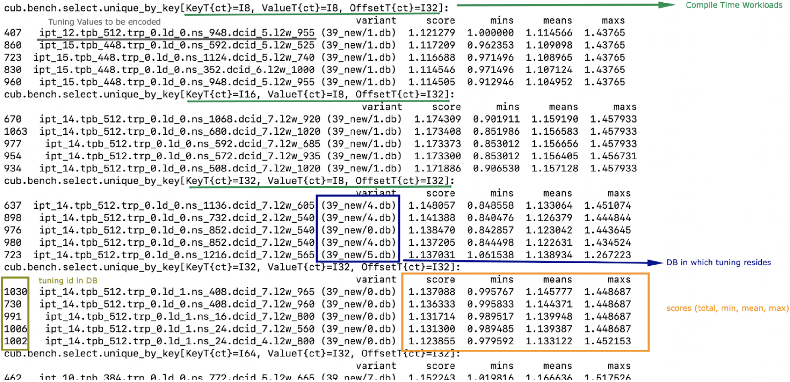
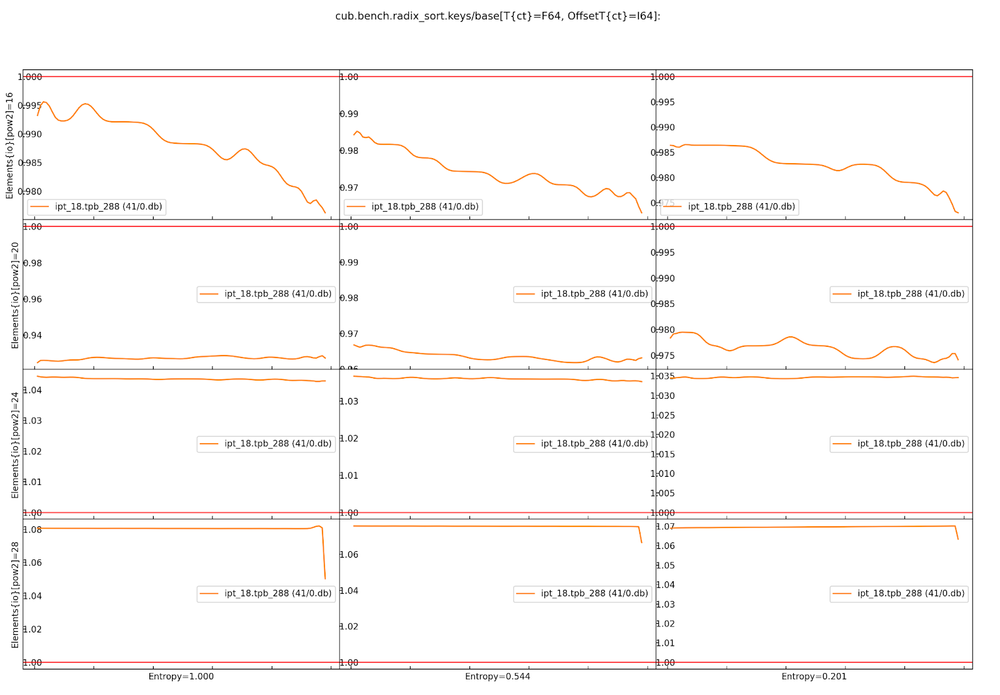

.. _cub-tuning:

CUB Tunings
================================================================================

The following is an analytical guide on how to tune CUB Device primitives for performance.

Device-scope algorithms in CUB have many knobs that significantly impact performance (without affecting correctness). For instance, the number of threads per block and items per thread can be tuned to maximize performance for a given device and data type.
This document describes CUB's tuning Infrastructure, a set of tools facilitating the process of
selecting optimal tuning parameters for a given device and data type.

Terminology
--------------------------------------------------------------------------------

*We omit the word "tuning" but assume it in the definitions for all terms below,
so those terms may mean something else in a more generic context.*

The following three terms are fundamental to understanding the essence of CUB tuning:

* **compile-time (ct) workload**: a workload that can be recognized only at compile time.

*e.g. the combination of key type and offset type,* :code:`int16_t` *and* :code:`int32_t`

* **runtime (rt) workload**: a workload that can be recognized only at runtime.

*e.g. the number of input elements*

* **tuning parameter (or parameter)**: a parameter that can be tuned to maximize performance for a given device and data type.

*e.g. number of threads per block, items per thread*

Algorithms are tuned for different workloads. These workloads are defined as subspaces by NVBench via the benchmarks' axis.
For instance, radix sort can be tuned for different key types, different number of keys, and different distributions of keys. The tuning process is summarized in
the following statement:

.. raw:: html

   

       "For each Compile-time Workload, we search for the best tuning parameters"
   

More specifically, the tuning infrastructure optimizes algorithms for specific compile-time workloads,
aggregating results across all runtime workloads.
It searches through a space of parameters to find the combination for a given compile-time workload with the highest score.

--------

Following is supplemental terminology that will be used throughout the rest of this tuning guide:

.. e.g. :math:`threads\_per\_block=128`

* **Parameter Space**: the set of all possible values for a given Tuning Parameter.

*It is specific to the algorithm*. For example the parameter space for the number of threads per block can be :math:`\{32, 64, 96, 128, \dots, 1024\}` for radix sort, but :math:`\{32, 64, 128, 256, 512\}` for merge sort.

* **Search Space**: Cartesian product of all the Parameter Spaces of a single algorithm.

For instance, the Search Space for an algorithm with tunable items per thread and threads per block might look like :math:`\{(ipt \times tpb) | ipt \in \{1, \dots, 25\} \text{and} tpb \in \{32, 64, 96, 128, \dots, 1024\}\}`.

* **Variant** - a point in the corresponding Search Space.

* **Base** - the variant that CUB uses by default.

* **Score** - a single number representing the performance for a given compile-time workload across all runtime workloads. For instance, a weighted-sum of speedups of a given variant compared to its base for all runtime workloads is a score.

.. * **Search** - a process consisting of covering all variants for all compile-time workloads to find a variant with maximal score.
..  ^^^ @giannis: again we do not want to scare a first time user with too many terms. "search" is both evident and can also be explained with an introductory sentence in the "Search Process" chapter ^^^

.. _cub-tuning-authoring-benchmarks:

Authoring Benchmarks
--------------------------------------------------------------------------------

CUB benchmarks are split into multiple files based on the algorithm they are testing
and potentially further into compile-time flavors that are tuned for individually
(e.g. sorting only keys vs. key-value pairs, or reducing using sum vs. using min).
The name of the directory represents the name of the algorithm.
The filename corresponds on the flavor.
For instance, the benchmark :code:`benchmarks/bench/radix_sort/keys.cu` tests the radix sort implementation sorting only keys.
The executable file name is going to be transformed into :code:`cub.bench.radix_sort.keys.*`,
which is the benchmark name reported by the infrastructure.

+++++++++++++++
Headers
+++++++++++++++

**Benchmarks are based on NVBench.**
You start writing a benchmark by including :code:`nvbench_helper.cuh`. This contains all
necessary includes and definitions.

.. code:: c++

  #include <nvbench_helper.cuh>

The next step is to define a search space. The search space is represented by a number of C++ comments.
The format consists of the :code:`%RANGE%` keyword, the parameter macro, the parameter abbreviation, and its range of values.
The range is represented by three numbers: :code:`start:end:step`.
Start and end are included.
For instance, the following code defines a search space for two parameters, the number of threads per block and items per thread.

.. code:: c++

  // %RANGE% TUNE_ITEMS_PER_THREAD ipt 7:24:1
  // %RANGE% TUNE_THREADS_PER_BLOCK tpb 128:1024:32

Next, you need to define a benchmark function. The function accepts :code:`nvbench::state &state` and
a :code:`nvbench::type_list`. For more details on the benchmark signature, take a look at the
`NVBench documentation <https://github.com/NVIDIA/nvbench>`_.

.. code:: c++

  template <typename T, typename OffsetT>
  void algname(nvbench::state &state, nvbench::type_list<T, OffsetT>)
  {...}

.. @giannis: not sure if Policy Hub should be part of "Authoring Benchmarks" since it's attached to the Dispatch Layer. Policy Hub
.. is not supposed to be used only when we run benchmarks, but in general when a primitive is invoked with specific compile time params.

Before proceeding further with the benchmark authoring it is imperative to understand the Policy Hub mechanism.

++++++++++
Policy Hub
++++++++++

Tuning relies on CUB's device algorithms to expose a dispatch layer which can be parameterized by a Policy Hub. The Policy Hub is an intermediate
class that enables tuning. In other words it translates the SM architecture, the input types etc. which accepts at instantiation as input,
into the parameter values that are optimal for when executing the specific compile time workload.

CUB usually provides a default policy hub, but when tuning we want to overwrite it, so we have to specialize the dispatch layer.
**The tuning infrastructure will use the** :code:`TUNE_BASE` **macro to distinguish between compiling the base version (i.e. baseline) of a benchmark
and compiling a variant for a given set of tuning parameters.**
When base is used, no policy is specified, so that the default policy CUB provides is used.
If :code:`TUNE_BASE` is not defined, we specify a custom policy
using the parameter macros defined in the :code:`%RANGE%` comments which define the search space.

The following code is included in the benchmark for the policy hub to be enabled and the parameters to have effect in execution:

..
    The following code is repeated further down as well. Please keep in sync!

.. code:: c++

  #if TUNE_BASE
    using dispatch_t = cub::DispatchReduce<T, OffsetT>; // uses default policy hub
  #else
    template <typename AccumT, typename OffsetT>
    struct policy_hub_t {
      struct MaxPolicy : cub::ChainedPolicy<300, policy_t, policy_t> {
        static constexpr int threads_per_block  = TUNE_THREADS_PER_BLOCK;
        static constexpr int items_per_thread   = TUNE_ITEMS_PER_THREAD;
        ...
      };
    };

    using dispatch_t = cub::DispatchReduce<T, OffsetT, policy_hub_t<accum_t, offset_t>>;
  #endif

The custom policy hub used for tuning should only expose a single :code:`MaxPolicy` for CUB to use.
It must contain all parameters required for the full definition of the search space.

+++++++++
Main Body
+++++++++

The :code:`state` passed into the benchmark function allows access to runtime workload axes,
for example the number of elements to process.
*When creating containers for the input avoid to initialize data yourself.
Instead, use the* :code:`gen` *function,
which will fill the input vector with random data on GPU with no compile-time overhead.*

.. code:: c++

    const auto elements = static_cast<std::size_t>(state.get_int64("Elements{io}"));
    thrust::device_vector<T> in(elements);
    thrust::device_vector<T> out(1);

    gen(seed_t{}, in);

In addition to the benchmark runtime, NVBench can also report information on the achieved memory bandwidth.
For this, you can optionally provide information on the memory reads and writes of the algorithm to the :code:`state`:

.. code:: c++

    state.add_element_count(elements);
    state.add_global_memory_reads<T>(elements, "Size");
    state.add_global_memory_writes<T>(1);

Most CUB algorithms need to be called twice:

1. once to query the amount of temporary storage needed,
2. once to run the actual algorithm.

We perform the first call now and allocate temporary storage:

.. code:: c++

    std::size_t temp_size;
    dispatch_t::Dispatch(nullptr,
                         temp_size,
                         d_in,
                         d_out,
                         static_cast<offset_t>(elements),
                         0 /* stream */);

    thrust::device_vector<char> temp(temp_size);
    auto *temp_storage = thrust::raw_pointer_cast(temp.data());

Finally, we can execute the timed region of the benchmark,
which contains the second call to a CUB algorithm and performs the actual work we want to benchmark:

.. code:: c++

    state.exec(nvbench::exec_tag::gpu | nvbench::exec_tag::no_batch,
               [&](nvbench::launch &launch) {
      dispatch_t::Dispatch(temp_storage,
                           temp_size,
                           d_in,
                           d_out,
                           static_cast<offset_t>(elements),
                           launch.get_stream());
    });
  }

This concludes defining the benchmark function.
Now we need to tell NVBench about it.

++++++++++++++++++
NVBench Attributes
++++++++++++++++++

.. code:: c++

  NVBENCH_BENCH_TYPES(algname, NVBENCH_TYPE_AXES(all_types, offset_types))
    .set_name("base")
    .set_type_axes_names({"T{ct}", "OffsetT{ct}"})
    .add_int64_power_of_two_axis("Elements{io}", nvbench::range(16, 28, 4));

:code:`NVBENCH_BENCH_TYPES` registers the benchmark as one with multiple compile-time workloads,
which are defined by the Cartesian product of the type lists in :code:`NVBENCH_TYPE_AXES`.
:code:`set_name(...)` sets the name of the benchmark.
Only alphabetical characters, numbers and underscores are allowed in the benchmark name.

Furthermore, compile-time axes should be suffixed with :code:`{ct}`. The runtime axes might be optionally annotated
as :code:`{io}` which stands for importance-ordered. *This will tell the tuning infrastructure that
the later values on the axis are more important. If the axis is not annotated, each value will be
treated as equally important.*

When you define a type axis annotated with :code:`{ct}`, you should consider optimizing
the build time. Many variants are going to be build, but the search is considering one compile-time
use case at a time. This means that if you have many types to tune for, you'll end up having
many template specializations that you don't need. To avoid this, for each compile time axis, the tuning framework will predefine
a `TUNE_AxisName` macro with the type that's currently being tuned. For instance, if you
have the type axes :code:`T{ct}` and :code:`OffsetT` (as shown above), you can use the following
pattern to narrow down the types you compile for:

.. code:: c++

  #ifdef TUNE_T
  using all_types = nvbench::type_list<TUNE_T>;
  #else
  using all_types = nvbench::type_list<char, short, int, long, ...>;
  #endif

  #ifdef TUNE_OffsetT
  using offset_types = nvbench::type_list<TUNE_OffsetT>;
  #else
  using offset_types = nvbench::type_list<int32_t, int64_t>;
  #endif

This logic is already implemented if you use any of the following predefined type lists:

.. list-table:: Predefined type lists
   :header-rows: 1

   * - Axis name
     - C++ identifier
     - Included types
   * - :code:`T{ct}`
     - :code:`integral_types`
     - :code:`int8_t, int16_t, int32_t, int64_t`
   * - :code:`T{ct}`
     - :code:`fundamental_types`
     - :code:`integral_types` and :code:`int128_t, float, double`
   * - :code:`T{ct}`
     - :code:`all_types`
     - :code:`fundamental_types` and :code:`complex`
   * - :code:`OffsetT{ct}`
     - :code:`offset_types`
     - :code:`int32_t, int64_t`

You are free to define your own axis names and use the logic above for them (see the sort pairs example).

A single benchmark file can define multiple benchmarks (multiple benchmark functions registered with :code:`NVBENCH_BENCH_TYPES`).
All benchmarks in a single file must share the same compile-time axes.
**The tuning infrastructure will run all benchmarks in a single file together for the same compile-time workload
and compute a common score across all benchmarks and runtime workloads.
Unless a benchmark axis is importance-ordered, each sample contributes equally to the score.**
This is useful to tune an algorithm for multiple runtime use cases at once,
that we don't intend to provide separate tuning policies for.
Also, a large space of runtime workloads can be segmented this way,
e.g. by splitting the benchmark entry point and supplying a few low and a few high values for a runtime axis:

.. code:: c++

  NVBENCH_BENCH_TYPES(algname, NVBENCH_TYPE_AXES(all_types, offset_types))
    .set_name("small")
    ...
    .add_int64_power_of_two_axis("SegmentSize", nvbench::range(0, 3, 1)); // tests sizes 2^0, 2^1, 2^2, 2^3

  NVBENCH_BENCH_TYPES(algname, NVBENCH_TYPE_AXES(all_types, offset_types))
    .set_name("large")
    ...
    .add_int64_power_of_two_axis("SegmentSize", nvbench::range(12, 18, 2)); // tests sizes 2^12, 2^14, 2^16, 2^18

Search Process
--------------------------------------------------------------------------------

During the Search Process we are covering all variants for all compile-time workloads to find a variant with a maximum (at least locally) score.

To get started with tuning, you need to configure CMake.
You can use the following command:

.. code:: bash

  $ mkdir build
  $ cd build
  $ cmake .. --preset=cub-tune

You can then run the tuning search for a specific algorithm and compile-time workload. We use a CCCL internal script for that:

.. code:: bash

  $ ../benchmarks/scripts/search.py -R '.*merge_sort.*pairs' -a 'KeyT{ct}=I128' -a 'Elements{io}[pow2]=28'
  cub.bench.merge_sort.pairs.trp_0.ld_1.ipt_13.tpb_6 0.6805093269929858
  cub.bench.merge_sort.pairs.trp_0.ld_1.ipt_11.tpb_10 1.0774560502969677
  ...

This will search the space of merge sort for key-value pairs, for the key type :code:`int128_t` on :code:`2^28` elements.
The :code:`-R` and :code:`-a` options are optional. **If not specified, all benchmarks are going to be tuned.**
The :code:`-R` option can select multiple benchmarks using a regular expression.
For the axis option :code:`-a`, you can also specify a range of values like :code:`-a 'KeyT{ct}=[I32,I64]'`.
Any axis values not supported by a selected benchmark will be ignored.
The first variant :code:`cub.bench.merge_sort.pairs.trp_0.ld_1.ipt_13.tpb_6` has a score <1 and is thus generally slower than the baseline,
whereas the second variant :code:`cub.bench.merge_sort.pairs.trp_0.ld_1.ipt_11.tpb_10` has a score of >1 and is thus an improvement over the baseline.

.. warning::
  Notice there is currently a limitation in :code:`search.py`
  which will only execute runs for the first axis value for each axis
  (independently of whether the axis is specified on the command line or not).
  Tuning for multiple axis values requires multiple runs of :code:`search.py`.
  Please see `this issue <https://github.com/NVIDIA/cccl/issues/2267>`_ for more information.

**Benchmarks do not need to be built a priori.** The tuning framework will handle building the benchmarks (base and variants) and running them by itself.
It will keep track of the build time for base and variants.
Sometimes, a tuning variant may lead the compiler to hang or take exceptionally long to compile.
To keep the tuning process going, if the build time of a variant exceeds a threshold, the build is cancelled.
The same applies to benchmarks running for too long.

To get quick feedback on what benchmarks are selected and how big the search space is,
you can add the :code:`-l` option:

.. code:: bash

  $ ../benchmarks/scripts/search.py -R '.*merge_sort.*pairs' -a 'KeyT{ct}=I128' -a 'Elements{io}[pow2]=28' -l
  ctk:  12.6.85
  cccl:  v2.7.0
  ### Benchmarks
    * `cub.bench.merge_sort.pairs`: 540 variants:
      * `trp`: (0, 2, 1)
      * `ld`: (0, 3, 1)
      * `ipt`: (7, 25, 1)
      * `tpb`: (6, 11, 1)

It will list all selected benchmarks as well as the total number of variants (the magnitude of the search space)
as a result of the Cartesian product of all its tuning parameter spaces.

The tuning infrastructure stores the results in an SQLite database called :code:`cccl_meta_bench.db` in the build directory.
This database persists across tuning runs.
If you interrupt the benchmark script and then launch it again, only missing benchmark variants will be run.

Tuning on multiple GPUs
--------------------------------------------------------------------------------

Because the search process computes scores by comparing the performance of a variant to the baseline,
it has to store the baseline result in the tuning database.
The baseline is specific to the physical GPU on which it was obtained.
Therefore, a single tuning database should not be used to run the tuning search on two different GPUs, even of the same architecture.
Similarly, you should also not interrupt the search and resume it on a different GPU.
Be careful when sharing build directories over network file systems.
Check whether a build directory already contains a :code:`cccl_meta_bench.db` from a previous run before starting a new search.

..
    TODO(bgruber): I don't yet understand whether we can tune a single variant on multiple GPUs.
    I think this is possible, but would it then create a database per GPU (because 1 baseline per GPU)?
    Does search.py do this automatically, or do I need to pass a flag? Or does this only work with our "internal extensions"?

Because the search space can be separated based on different axis values,
a tuning search can be run on multiple GPUs in parallel, even across multiple physical machines (e.g., on a cluster).
To do this, :code:`search.py` is invoked in parallel, one invocation/process per GPU,
with different axis values specified for each invocation.
A dedicated tuning database will be created per physical GPU.
If a shared filesystem is in use, make sure that :code:`search.py` is run from different directories,
so the :code:`cccl_meta_bench.db` files are placed into distinct paths.

It is recommended to drive a multi-GPU/multi-node search process from a script,
iterating the axis values and invoking :code:`search.py` for each variant.
This integrates nicely with workload managers on clusters, which allow submitting batch jobs.
In such a scenario, it is recommended to submit a job per variant.

After tuning on multiple GPUs, the results are available in multiple tuning databases, which can be analyzed together.

Analyzing the results
--------------------------------------------------------------------------------

The result of the search is stored in one or more :code:`cccl_meta_bench.db` files. To analyze the
result you can use the :code:`analyze.py` script.
The :code:`--coverage` flag will show the amount of variants that were covered per compile-time workload:

.. code:: bash

  $ ../benchmarks/scripts/analyze.py --coverage
    cub.bench.radix_sort.keys[T{ct}=I8, OffsetT{ct}=I32] coverage: 167 / 522 (31.9923%)
    cub.bench.radix_sort.keys[T{ct}=I8, OffsetT{ct}=I64] coverage: 152 / 522 (29.1188%)

The :code:`--top N` flag will list the best :code:`N` variants for each compile-time workload:

.. code:: bash

  $ ../benchmarks/scripts/analyze.py --top=5
    cub.bench.radix_sort.keys[T{ct}=I8, OffsetT{ct}=I32]:
              variant     score      mins     means      maxs
    97  ipt_19.tpb_512  1.141015  1.039052  1.243448  1.679558
    84  ipt_18.tpb_512  1.136463  1.030434  1.245825  1.668038
    68  ipt_17.tpb_512  1.132696  1.020470  1.250665  1.688889
    41  ipt_15.tpb_576  1.124077  1.011560  1.245011  1.722379
    52  ipt_16.tpb_512  1.121044  0.995238  1.252378  1.717514
    cub.bench.radix_sort.keys[T{ct}=I8, OffsetT{ct}=I64]:
              variant     score      mins     means      maxs
    71  ipt_19.tpb_512  1.250941  1.155738  1.321665  1.647868
    86  ipt_20.tpb_512  1.250840  1.128940  1.308591  1.612382
    55  ipt_17.tpb_512  1.244399  1.152033  1.327424  1.692091
    98  ipt_21.tpb_448  1.231045  1.152798  1.298332  1.621110
    85  ipt_20.tpb_480  1.229382  1.135447  1.294937  1.631225

The name of the variant contains the short parameter names and values used for the variant.
For each variant, a score is reported. The base has a score of 1.0, so each score higher than 1.0 is an improvement over the base.
However, because a single variant contains multiple runtime workloads, also the minimum, mean, maximum score is reported.
If all those three values are larger than 1.0, the variant is strictly better than the base.
If only the mean or max are larger than 1.0, the variant may perform better in most runtime workloads, but regress in others.
This information can be used to change the existing tuning policies in CUB. A detailed explanation of the output is presented
in the following image:

By default, :code:`analyze.py` will look for a file named :code:`cccl_meta_bench.db` in the current directory.
If the tuning results are available in multiple databases, e.g., after tuning on multiple GPUs,
glob expressions matching multiple databases, or just multiple file paths, can be passed as arguments as well:

.. code:: bash

  $ ../benchmarks/scripts/analyze.py --top=5 <path-to-databases>/*.db

In case the tuning database(s) store(s) results for several different benchmarks,
the analysis can again be restricted using a regular expression via the :code:`-R` option:

.. code:: bash

  $ ../benchmarks/scripts/analyze.py -R=".*radix_sort.keys.*"  --top=5 <path-to-databases>/*.db

Variant plots
--------------------------------------------------------------------------------

The reported score for a tuning aggregates the performance across all runtime workloads.
Furthermore, NVBench collects and aggregates multiple samples for a single compile and runtime workload.
So, even though the min, mean and max score are reported for a variant,
it may be necessary to compare the distributions of raw speedups between the baseline and a variant across all runtime workloads and samples.
This is achieved using variant plots.
For more background information on this subject, we refer the reader to `this article <https://aakinshin.net/posts/shift-and-ratio-functions/>`_.

A variant plot can be generated for one or more variants using the :code:`--variants-ratio=` option and specifying the specific variant to plot.
For example:

.. code:: bash

  $ ../benchmarks/scripts/analyze.py -R=".*radix_sort.keys.*" --variants-ratio='ipt_18.tpb_288' <path-to-databases>/*.db

May display a matrix of variant plots like:

In the image above we see twelve diagrams for the Cartesian product of the :code:`Entropy` (horizontally) and :code:`Elements{io}` (vertically) runtime axes.
The compile-time axes are fixed for one matrix of variant plots.
Across each variant plot's x-axis, the speedup over the baseline (y-axis) is represented.
The baseline is shown as a straight horizontal red line at 1.
The found tuning thus results in a slowdown for :code:`Elements{io}` 2^16 and 2^20 (orange line below red baseline),
but a speedup for 2^24 and 2^28 (orange line above red baseline).
In general, bigger axis values for plots for importance-ordered axes, like :code:`Elements{io}`,
should be prioritized in evaluating a given tuning, because GPUs are optimized for large problem sizes.
However, while the almost 4% slowdown for 2^16 elements at entropy 0.544 may be bearable,
a close to 7% slowdown for 2^20 elements at entropy 1 is probably too large to accept this tuning,
despite the solid 3.5-8% speedup for larger element counts.

The shown ratios are generated by fitting an equal amount of quantiles into the samples of the baseline and the variant,
and then showing the quotient for each corresponding quantile from baseline and variant.
For background information on the quantile-respectful density estimation,
we refer the reader to this `article <https://aakinshin.net/posts/qrde-hd>`_.
By default, a quantile corresponds to a percentile, and thus a ratio plot contains 100 data points
expressing the speedup of the slowest 1% in the variant over the slowest 1% in the baseline (left),
then the second slowest 1%, etc., until the speedup of the fastest 1% in the variant over the fastest 1% in the baseline (right).

The detailed analysis via variant plots is needed,
because a single aggregated score cannot represent the distribution of samples obtained from highly concurrent algorithms, such as those in CUB.
Even though NVBench reruns a benchmark many times to gain statistical confidence in the result,
the runtime of a CUB algorithm does not necessarily follow a normal distribution.
For example, the concurrent nature of some algorithms may result in bimodal or even more complex distributions,
as a consequence of how the hardware schedules and executes threads.
Also, the kind of distribution may be different between baseline and variant.
For all these reasons, comparing the distribution of samples is the only reliable way to determine,
whether a tuning provides a consistent speedup for all runtime workloads.

Creating tuning policies
--------------------------------------------------------------------------------

Once a suitable tuning result has been selected, we have to translate it into C++ code that will be picked up by CUB.
The tuning variant name shown by :code:`analyze.py` gives us all the information on the selected tuning values.
Here is an example:

.. code:: bash

  $ ../benchmarks/scripts/analyze.py --top=1
    cub.bench.radix_sort.keys[T{ct}=I8, OffsetT{ct}=I64]:
              variant     score      mins     means      maxs
    71  ipt_19.tpb_512  1.250941  1.155738  1.321665  1.647868

Assume we have determined this tuning to be the best one for sorting I8 keys using radix_sort using I64 offsets.
The ``variant`` can be decoded using the ``// %RANGE%`` comments in the C++ source code of the benchmark,
since the names of the reported parameters in the variant are derived from these:

.. code::  c++

    // %RANGE% TUNE_ITEMS_PER_THREAD ipt 7:24:1
    // %RANGE% TUNE_THREADS_PER_BLOCK tpb 128:1024:32

The variant ``ipt_19.tpb_512``, which stands for 19 items per thread (``ipt``) and 512 threads per block (``tpb``),
was thus compiled with ``-DTUNE_ITEMS_PER_THREAD=19 -DTUNE_THREADS_PER_BLOCK=512``.
The meaning of these values is specific to the benchmark definition,
and we have to check the benchmark’s source code for how they are applied.
Equally named tuning parameters may not translate to different benchmarks (please double check).
These tuning parameters are then typically used to create a policy hub,
which is passed to the algorithm’s dispatcher, as :ref:`sketched above <cub-tuning-authoring-benchmarks>`,
and repeated here:

.. code:: c++

  #if !TUNE_BASE
    template <typename AccumT, typename OffsetT>
    struct policy_hub_t {
      struct MaxPolicy : cub::ChainedPolicy<300, policy_t, policy_t> {
        static constexpr int threads_per_block  = TUNE_THREADS_PER_BLOCK;
        static constexpr int items_per_thread   = TUNE_ITEMS_PER_THREAD;
        using AlgorithmPolicy = AgentAlgorithmPolicy<threads_per_block, items_per_thread, ...>;
      };
  #endif

.. @giannis: sentences below are loaded simplify/expand them

The tunings defined in CUB's source are similar.
However, they take predefined tuning values based on the template arguments of a CUB algorithm
to build an agent policy for the policy hub.
The way tuning values are selected is different for each CUB algorithm and requires studying the corresponding code.
The general principles of the policy hub and tunings are documented in the :ref:`CUB device layer documentation <cub-developer-policies>`.
There is typically a tuning class template specialization per variant or group of variants and per PTX version.
For example, signed and unsigned integers of the same size are often represented by the same tuning.
In general, variants for which the algorithmic behavior is expected to be the same
(same arithmetic intensity, no special instructions for one of the data types, same amount of bytes to load/store, etc.)
are covered by the same tuning.

When new tuning values have been found and an existing tuning specialization exists for this variant,
the tuning values can simply be updated in the corresponding CUB tuning header.
This is usually the case when a CUB algorithm has been reengineered and shows different performance characteristics,
or more tuning parameters are exposed (e.g., a new load algorithm is available).
For example, this existing radix sort tuning may exist:

.. code:: c++

    template <typename ValueT, size_t KeySize, size_t ValueSize, size_t OffsetSize>
    struct sm100_small_key_tuning : sm90_small_key_tuning<KeySize, ValueSize, OffsetSize> {};
    ...
    template <typename ValueT>
    struct sm100_small_key_tuning<ValueT, 1, 0, 8> {
      static constexpr int threads = 256; // better value from tuning analysis: 512
      static constexpr int items = 14;    // better value from tuning analysis: 19
    };

The template specialization applies when sorting 1-byte keys without values 8-byte offsets.
However, the concrete value type is disregarded.
Since we have found that 512 threads per block and 19 items per thread is better, we can update the values in place.

A different case is when we tune beyond what's currently supported by CUB's existing tunings.
This may be because we tune for a new hardware architecture,
in which case a new tuning class template and specializations should be added.
Or we tune for new key, value or offset types, etc.,
in which case the existing policy hub and tuning class templates may need to be extended.
There is no general rule on how this extension is done, though.

In the seldom case, that no tuning better than the existing one (baseline) has been found,
it must be ensured that either the old tuning values are replicated in the new tuning specialization,
or the new tuning specialization defers to the old one,
or the tuning selection mechanism falls back accordingly.
There is no general rule on how this is implemented.

Verification
--------------------------------------------------------------------------------

Once we have selected tunings and implemented them in CUB, we need to verify them.
This process consists of two steps.

Firstly, we need to ensure that adding new tunings and policies did not break existing tunings.
This is most relevant when tunings for new PTX versions have been added.
To verify this, compile the corresponding benchmarks for the previous architecture
(excluding the new tunings) before and after modifying any tunings,
and compare the generated SASS :code:(`cuobjdump -sass`).
It should not have changed.

Secondly, we must benchmark and compare the performance of the tuned algorithm before and after the tunings have been applied.
This extra step is needed, because the score shown during the tuning analysis is just an aggregated result.
Individual benchmarks may still have regressed for some compile-time workloads.
Fortunately, this is no different than :ref:`running <cub-benchmarking-running>` the corresponding CUB benchmark with and without the changes,
and :ref:`comparing <cub-benchmarking-comparing>` the resulting JSON files.
Such a diff should be supplied to any request to change CUB tunings.

If verification fails for some compile-time workloads (there are regressions), there are two options:

1. Discard the tuning entirely and ensure the tuning selection falls back to the baseline tuning.
2. Narrow down the tuning template specialization to only apply to the workloads where it improves performance,
   and fallback where it regressed.

The latter is more complex and may not be justified, if the improvements are small or the use case too narrow.
Use your judgement. Good luck!
