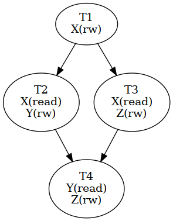
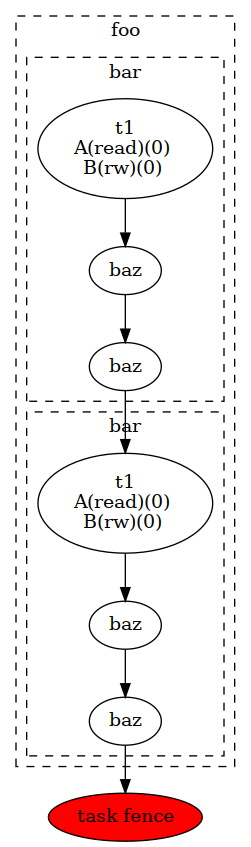
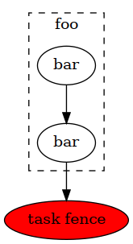

.. _stf:

CUDASTF
=======

.. contents::
   :depth: 2

CUDASTF is an implementation of the Sequential Task Flow model for CUDA.

The availability of parallelism within modern hardware has dramatically
increased, with large nodes now featuring multiple accelerators. As a
result, maximizing concurrency at the application level in a scalable
manner has become a crucial priority. To effectively hide latencies, it
is essential to achieve the highest level of asynchrony possible.

CUDASTF introduces a tasking model that automates data transfers while
enforcing implicit data-driven dependencies.

Implemented as a header-only C++ library, CUDASTF builds on top of CUDA
APIs to simplify the development of multi-GPU applications.

CUDASTF enables the creation of highly concurrent parallel applications,
leveraging both the CUDA stream API and the CUDA graph API for efficient
task orchestration and data management. The same client code can run
optimally on single- and multi-GPU systems.

The Sequential Task Flow (STF) programming model
------------------------------------------------

The CUDASTF programming model involves defining logical data and
submitting tasks that operate on this data. CUDASTF automatically
deduces the dependencies between different tasks and orchestrates both
computation and data movement to ensure efficient execution with as much
concurrency as possible.

CUDASTF employs the `Sequential Task
Flow <https://inria.hal.science/hal-01618526>`__ (STF) programming
model, which enables the extraction of concurrency from a sequence of
tasks annotated with appropriate data accesses and their respective
modes (read-only, write-only, or read/write).

For instance, two tasks modifying the same data will be serialized (in
order to maintain read-after-write and write-after-write coherency),
whereas two tasks reading the same data without modification can be
executed concurrently (read-after-read is coherent in any order). A task
must wait until all preceding modifications have been completed before
reading a piece of data (read-after-write). Similarly, a task that needs
to modify data can only do so once all preceding reads have finished
(write-after-read).

Applying these simple rules to a complex algorithm (initially expressed
serially as a sequence of tasks) results in a directed acyclic graph
(DAG) of tasks, which enables CUDASTF to devise concurrent execution for
the given algorithm.

By providing data use annotations to CUDASTF, programmers benefit from
both automated parallelization and transparent data management. Through
a specialized cache coherency protocol, CUDASTF automates data
allocation and transfers. As a result, programmers can focus on
developing efficient task-based algorithms instead of grappling with
asynchrony and asynchronous data management.

To illustrate how a sequence of tasks can be transformed into a parallel
application using annotated data accesses, consider the following
example involving three logical data pieces denoted as ``X``, ``Y``,
and ``Z``:

::

   T1[X(rw)], T2[X(read), Y(rw)], T3[X(read), Z(rw)], T4[Y(read), Z(rw)]

``T2`` and ``T3`` read ``X``, which is modified by ``T1``, creating a
read-after-write dependency between ``T1`` and ``T2``, as well as
between ``T1`` and ``T3``. Since ``T2`` and ``T3`` only perform
concurrent read accesses, they can execute concurrently. ``T4`` reads
``Y`` and ``Z``, which were modified by ``T2`` and ``T3``, respectively,
resulting in write-after-read dependencies between ``T2`` and ``T4``,
and between ``T3`` and ``T4``. The resulting dependency graph is shown
below.

Getting started with CUDASTF
----------------------------

Getting CUDASTF
^^^^^^^^^^^^^^^

CUDASTF is part of the CUDA Experimental library of the CCCL project. It is not distributed with the CUDA Toolkit like the rest of CCCL. It is only available on the `CCCL GitHub repository <https://github.com/NVIDIA/cccl>`_.

Using CUDASTF
^^^^^^^^^^^^^

CUDASTF is a header-only C++ library which only require to include its
main header. CUDASTF API is part of the ``cuda::experimental::stf`` C++
namespace, and we will assume for brevity that we are using this
workspace in the rest of this document.

.. code:: cpp

   #include <cuda/experimental/stf.cuh>

   using cuda::experimental::stf;

Compiling
^^^^^^^^^

CUDASTF requires a compiler conforming to the C++17 standard or later.
Although there is no need to link against CUDASTF itself, the library
internally utilizes the CUDA library.

.. code:: bash

   # Compilation flags
   nvcc -std=c++17 --expt-relaxed-constexpr --extended-lambda -I$(cudastf_path)
   # Linking flags
   nvcc -lcuda

It is also possible to use CUDASTF without ``nvcc``. This is for example
useful when calling existing CUDA libraries such as CUBLAS which do not
require authoring custom kernels. Note that CUDASTF APIs intended to
automatically generate CUDA kernels such as ``parallel_for`` or
``launch`` are disabled when compiling without nvcc.

.. code:: bash

   # Compilation flags
   g++ -I$(cudastf_path)
   # Linking flags
   g++ -lcuda -lcudart

Using CUDASTF within a CMake project
^^^^^^^^^^^^^^^^^^^^^^^^^^^^^^^^^^^^

As part of the CCCL project, CUDASTF uses CMake for its build and installation
infrastructure, and is the recommended way of building applications that use
CUDASTF.

This is facilitated by the CMake Package Manager as illustrated in this simple example which is available `here <https://github.com/NVIDIA/cccl/tree/main/examples/cudax_stf>`_, and which is described in the next paragraph.

A simple example
^^^^^^^^^^^^^^^^

The following example illustrates the use of CUDASTF to implement the
well-known AXPY kernel, which computes ``Y = Y + alpha * X`` where ``X``
and ``Y`` are two vectors, and ``alpha`` is a scalar_view value.

.. code:: cpp

   #include <cuda/experimental/stf.cuh>

   using namespace cuda::experimental::stf;

   template <typename T>
   __global__ void axpy(T a, slice<T> x, slice<T> y) {
       int tid = blockIdx.x * blockDim.x + threadIdx.x;
       int nthreads = gridDim.x * blockDim.x;

       for (int ind = tid; ind < x.size(); ind += nthreads) {
           y(ind) += a * x(ind);
       }
   }

   int main(int argc, char** argv) {
       context ctx;

       const size_t N = 16;
       double X[N], Y[N];

       for (size_t ind = 0; ind < N; ind++) {
           X[ind] = sin((double)ind);
           Y[ind] = col((double)ind);
       }

       auto lX = ctx.logical_data(X);
       auto lY = ctx.logical_data(Y);

       double alpha = 3.14;

       /* Compute Y = Y + alpha X */
       ctx.task(lX.read(), lY.rw())->*[&](cudaStream_t s, auto sX, auto sY) {
           axpy<<<16, 128, 0, s>>>(alpha, sX, sY);
       };

       ctx.finalize();
   }

The code is organized into several steps, which will be described in
more detail in the following sections:

1. include CUDASTF headers
2. declare a CUDASTF context
3. create logical data
4. submit and wait for the completion of pending work

More examples can be found in the ``examples`` directory in the sources.

Compiling examples
^^^^^^^^^^^^^^^^^^

The following commands compile STF examples from the root of the CCCL sources.
Please note the ``-j`` option, which specifies how many processes should be used to
compile the examples. Not specifying it will launch as many processes as there
are processors on the machine, which might lead to an excessive resource
consumption and system instability.

.. code:: bash

    mkdir -p build
    cd build
    cmake .. --preset cudax
    cd cudax
    ninja cudax.examples.stf -j4

To launch examples, simply run binaries under the `bin/`
subdirectory in the current directory. For instance, to launch the `01-axpy`
example:

.. code:: bash

    ./bin/cudax.cpp17.example.stf.01-axpy

Backends and contexts
-------------------------------

The code snippet below includes the required CUDASTF header. It then
creates a context object, which is an entry point for every API calls,
and which stores the state of the CUDASTF library and to keep track of
all resources and all dependencies. This context must eventually be
destroyed using the ``finalize()`` method.

.. code:: cpp

   context ctx;

There are currently three context backends available in CUDASTF, with a
common API but possibly different implementations, and a few specific
extensions. The ``context`` class, which is a generic context
implementation should be preferred to write generic code. Using a
specific context type might reduce compilation time, but provide less
flexibility.

The ``stream_ctx`` class defines a context type that relies on CUDA
streams and CUDA events to implement synchronizations. Tasks are
launched eagerly. This is the context type used by default in the
generic ``context`` type.

The ``graph_ctx`` class is a context type that implements task
parallelism by the means of CUDA graphs. Tasks (and all related
operations) are put into CUDA graphs. Note that the lambda function
attached describing a task is captured immediately (during the
``ctx.task`` API call) even if the execution is deferred. The underlying
CUDA graph is launched when a synchronization with the host is needed,
or when the context is finalized. Other circumstances such as task
fences might flush all pending operations and result into a graph
launch. Subsequent operations would be put in a new CUDA graph.
Selecting this backend is an easy way to adopt CUDA graphs, and can be
beneficial in terms of performance with a repeated task patterns. Unlike
other context types, it is not allowed for a task to synchronize with
the CUDA stream (e.g. with ``cudaStreamSynchronize``) within a task.

Using either ``context``, ``stream_ctx``, or ``graph_ctx`` should result
in the same behaviour, even if the underlying implementation differs.
One may switch from a type to another one by adapting how we initialize
the context object, or by selecting an appropriate type to decide
statically:

.. code:: cpp

   // assigns a graph_ctx() to a generic context
   context ctx = graph_ctx();

   // statically select a context based on CUDA streams and CUDA events
   stream_ctx ctx;

   // statically select a context based on CUDA streams and CUDA events
   graph_ctx ctx;

For the most part, these types can be used interchangeably. The key
difference is that ``stream_ctx`` and ``graph_ctx`` are statically bound to
use either the CUDA stream or graph APIs, while ``context`` defers this
decision to runtime, allowing dynamic selection of the appropriate backend.
This flexibility does not introduce significant runtime overhead or
compilation time differences, but it may be necessary when the user needs
to select the context type dynamically (see Algorithms).

Tasks in the Stream backend
^^^^^^^^^^^^^^^^^^^^^^^^^^^

The ``stream_ctx`` backend utilizes CUDA streams and events to provide
synchronization. Each ``stream_task`` in the ``stream_ctx`` backend
represents a task that is associated with an input CUDA stream.
Asynchronous work can be submitted in the body of the task using this
input stream. Once the ``stream_task`` completes, all work submitted
within the task’s body is assumed to be synchronized with the associated
stream.

Users can query the stream associated to a ``stream_task`` using its
``get_stream()`` method.

Tasks in the Graph backend
^^^^^^^^^^^^^^^^^^^^^^^^^^

In the ``graph_ctx`` environment, a CUDA graph is either created
internally or passed in by the user during construction. If the user
supplies the CUDA graph, CUDASTF can automatically insert CUDA graph
nodes to enable subsequent tasks to be submitted as child graphs of the
user-supplied graph.

Creating a ``graph_task`` object results in creating a child graph in the
aforementioned graph associated to the ``graph_ctx`` object. The child
graph implements the body of the task, and CUDASTF automatically inserts
the appropriate dependencies to ensure this child graph is executed only
after all of its dependencies are fulfilled. CUDASTF may also add other
nodes in the supporting CUDA graph, such as those needed for data
transfers or data allocations.

Users can retrieve the graph associated to a ``graph_task`` by using its
``get_graph()`` method.

Logical data
------------

In traditional computing, “data”, such as a matrix describing a neural
network layer, typically refers to a location in memory with a defined
address. However, in mixed CPU/GPU systems, the same conceptual data may
exist simultaneously in multiple locations and have multiple addresses
(typically the CPU-tied RAM plus one or more copies in the
high-bandwidth memory used by GPUs). CUDASTF refers to such conceptual
data as *logical data*, an abstract handle for data that may get
transparently transferred to or replicated over the different places
used by CUDASTF tasks. When user code creates a logical data object from
a user-provided object (e.g. an array of ``double``), they transfer the
ownership of the original data to CUDASTF. As a result, any access to
the original data should be performed through the logical data
interface, as CUDASTF may transfer the logical data to a CUDA device
where it can be modified, rendering the original data invalid. By doing
this, user code is relieved of all memory allocation chores and of
keeping track of which physical location holds the correct data at
different stages of computation.

A logical data is created by calling the ``ctx.logical_data`` member
function. The resulting object will be used to specify data accesses
within tasks.

In the following example, a stack array ``X`` is used to define a new
logical data object ``lX``, which should be subsequently used instead of
``X``:

.. code:: cpp

   double X[N];
   auto lX = ctx.logical_data(X);

Each logical data object internally maintains various *data instances*,
which are replicas of the logical data at different *data places*. For
instance, there could be an instance in host memory, as well as
instances in the embedded memory of CUDA device 0 and CUDA device 1.
CUDASTF ensures that tasks have access to *valid* data instances where
they execute and may dynamically create new instances or destroy
existing ones.

In the example above, ``X`` is initially on the host (on the CPU stack).
If a task is subsequently launched on device ``0`` that modifies data
through ``lX``, a new data instance will be created in memory associated
with device ``0``. In addition making that allocation, CUDASTF ensures
that a data transfer is issued asynchronously from the host to the
device, so that the task is given a *valid* replica of ``X``. Given that
the task modifies data through ``lX``, the instance associated to the
host will also be invalidated, so CUDASTF will later copy data back to
the host if another task needs to access ``X`` from the CPU.

Data interfaces
^^^^^^^^^^^^^^^

CUDASTF implements a generic interface to manipulate different types of
data formats across the machine.

Every type of data format is described using three separate types :

- its shape, which stores parameters which will be common to all instance.  For
  a fixed-sized vector, the shape would for example contain the length of the
  vector.
- a per-instance type that describes a specific data instance. For a
  fixed-sized vector, this type would for example contain the address of the
  vector.
- a data interface class which implements operations such as allocating a data
  instance based on its shape, or copying an instance into another instance.

Defining custom data interfaces (advanced)
^^^^^^^^^^^^^^^^^^^^^^^^^^^^^^^^^^^^^^^^^^

.. toctree::
   :maxdepth: 1

   stf/custom_data_interface

CUDASTF API is designed to be extensible, so that advanced users may
define their own data interfaces. This can be useful when manipulating
data formats which are not regular multidimensional arrays, or to
provide a direct access to a domain-specific or an application-specific
data format.

A complete example is given :ref:`here <stf_custom_data_interface>` to
illustrate how to implement a custom data interface.

Write-back policy
^^^^^^^^^^^^^^^^^

When a logical data object is destroyed, the original data instance is
updated (unless the logical data was created without a reference value,
e.g. from a shape). The result is only guaranteed to be available on the
corresponding data place when after the ``finalize()`` method was called
on the context. Likewise, when calling ``finalize()`` a write-back
mechanism is automatically issued on all logical data associated to the
context if they were not already destroyed.

Write back is enabled by default, but it is possible to disable it for a
specific logical data by calling this method on a logical data :
``set_write_back(bool flag)``. Enabling write-back on a logical data
which was defined from a shape and has no reference data instance will
result in an error.

Slices
^^^^^^

To facilitate the use of potentially non-contiguous multi-dimensional
arrays, we have introduced a C++ data structure class called ``slice``.
A slice is a partial specialization of C++’s
``std::mdspan`` (or ``std::experimental::mdspan`` depending on the C++ revision).

.. code:: cpp

   template <typename T, size_t dimensions = 1>
   using slice = mdspan<T, dextents<size_t, dimensions>, layout_stride>;

When creating a ``logical_data`` from a C++ array, CUDASTF automatically
describes it as a slice instantiated with the scalar_view element type and
the dimensionality of the array. Here is an example with an 1D array of
``double``.

.. code:: cpp

   double A[128];
   context ctx;
   auto lA = ctx.logical_data(A);

Internally, all instances of ``A`` are described as ``slice<double, 1>``
where ``double`` is the scalar_view element type, and ``1`` is the
dimensionality of the array. The default dimension corresponds to ``1``,
so ``slice<double>`` is equivalent with ``slice<double, 1>``.

The ``mdspan`` facility provides a `variety of
methods <https://en.cppreference.com/w/cpp/container/mdspan>`__ also
available to its alias ``slice``:

-  ``T *data_handle()`` gives the address of the first element
-  ``operator()`` so that ``A(i)`` is the ``i``-th element of a slice of
   dimension ``1``, and ``A(i, j)`` is the element at coordinates
   ``(i, j)`` in a 2D slice.
-  ``size_t size()`` returns the total number of elements in the slice
-  ``size_t extent(size_t dim)`` returns the size of a slice in a given
   dimension (run-time version)
-  ``size_t stride(size_t dim)`` returns the distance in memory between
   two elements in a given dimension, expressed as a number of elements
   (run-time version)

Slices can be passed by value, copied, or moved. Copying a slice does
not copy the underlying data. Slices can be passed as arguments to CUDA
kernel. Example:

.. code:: cpp

   template <typename T>
   __global__ void axpy(T a, slice<T> x, slice<T> y) {
       int tid = blockIdx.x * blockDim.x + threadIdx.x;
       int nthreads = gridDim.x * blockDim.x;

       for (int ind = tid; ind < x.size(); ind += nthreads) {
           y(ind) += a * x(ind);
       }
   }

Defining multidimensional slices
~~~~~~~~~~~~~~~~~~~~~~~~~~~~~~~~

Slices can be used on data with multiple dimensions, and possibly
non-contiguous data.

For example, to define a 2D slice, we can use the ``make_slice`` method
which takes a base pointer, a tuple with all dimensions, and then the
*strides*. The number of stride values is equal to the number of
dimensions minus one. The i-th stride defines the number of elements in
memory between two successive elements along dimension i.

.. code:: c++

       double A[5 * 2];

       // contiguous 2D slice
       slice<double, 2> s = make_slice(A, std::tuple { 5, 2 }, 5);

       // non-contiguous 2D slice
       slice<double, 2> s2 = make_slice(A, std::tuple { 4, 2 }, 5);

In the second example, ``s2`` defines a non-contiguous 2D slice because
the stride is greater than the extent in the first dimension. We will
here *skip* an element between between ``s2(3, 0)`` (which is ``A[3]``)
and ``s2(0, 1)`` (which is ``A[5]``)

Similarly with 3D data, we need to define 2 strides and 3 extent values
:

.. code:: c++

       double A[5 * 3 * 40];

       // contiguous 3D slice
       slice<double, 3> s = make_slice(A, std::tuple { 5, 3, 40 }, 5, 5 * 3);

       // non-contiguous 3D slice
       slice<double, 3> s2 = make_slice(A, std::tuple { 4, 3, 40 }, 5, 5 * 3);

       // non-contiguous 3D slice
       slice<double, 3> s3 = make_slice(A, std::tuple { 5, 2, 40 }, 5, 5 * 3);

Such slices can also be used to create logical data :

.. code:: c++

       double A[32 * 32];

       // Contiguous 2D slice
       auto lX = ctx.logical_data(make_slice(A, std::tuple { 32, 32 }, 32));

       // Non-contiguous 2D slice
       auto lX2 = ctx.logical_data(make_slice(A, std::tuple { 24, 32 }, 32));

Defining logical data from a shape
^^^^^^^^^^^^^^^^^^^^^^^^^^^^^^^^^^

Data interfaces supports data which are only described as a shape. For
example, a user may want to define a vector of 10 integers, and later
fill it with a task. In this case, there is no need to have a *reference
instance* associated to that logical data because CUDASTF will
automatically allocate an instance on its first usage.

.. code:: cpp

   auto lX = ctx.logical_data(shape_of<slice<int>>(10));

   ctx.task(lX.write())->* {
       cudaMemsetAsync(X.data_handle(), 0, X.size()*sizeof(int), stream);
   };

In this example, ``lX`` is defined using a shape only, and there is no
physical backing needed to create it. Note that since there exists no
valid *data instance* of ``lX``, the first task needs to make a
write-only access (using the ``write()`` member of ``lX``). A write-only
access will indeed allocate ``lX`` at the appropriate location, but it
will not try to load a valid copy of it prior to executing the task.

Using other access modes such as ``read()``, ``relaxed()`` or ``rw()``
that attempt to provide a valid instance will result in an error.  The
``reduce()`` access mode can be used only if the reduction is not accumulating
its result with an existing value, so we can for example use
``reduce(reducer::sum<double>{})`` but not ``reduce(reducer::sum<double>{}, no_init{})``
on a logical data which has valid data instance.

Similarly, it is possible to define a logical data from a slice shapes
with multiple dimensions.

.. code:: cpp

   auto lX_2D = ctx.logical_data(shape_of<slice<double, 2>>(16, 24));
   auto lX_3D = ctx.logical_data(shape_of<slice<double, 3>>(16, 24, 10));

Tasks
-----

A task is created by calling the ``ctx.task`` member function. It takes
an optional argument that specifies the execution location of the task.
If none is provided, the current CUDA device will be used, which is
equivalent to passing ``exec_place::current_device()``. Data accesses
are specified using a list of data dependencies. Each dependency is
described by calling the ``read()``, ``rw()``, ``write()`` or ``reduce()``
method of the logical data object.

In the example below, ``X`` is accessed in read-only mode and ``Y``
needs to be updated so it uses a read-write access mode.

.. code:: cpp

   __global__ void axpy(size_t n, double a, const double *x, double *y) {
       int tid = blockIdx.x * blockDim.x + threadIdx.x;
       int nthreads = gridDim.x * blockDim.x;

       for (size_t ind = tid; ind < n; ind += nthreads) {
           y[ind] += a * x[ind];
       }
   }
   ...
   ctx.task(lX.read(), lY.rw())->*[&](cudaStream_t s, slice<const double> sX, slice<double> sY) {
       axpy<<<16, 128, 0, s>>>(sX.size(), alpha, sX.data_handle(), sY.data_handle());
   };

The object returned by the call ``ctx.task()`` overloads
``operator->*()`` to accept a lambda function on the right-hand side.
This makes it easy for user code to pass the task’s body to the context
with a syntax akin to a control flow statement. The first argument of
the lambda function is a ``cudaStream_t`` that can be used to submit
work asynchronously on the selected device within the body of the task.
For each logical data, CUDASTF passes a *data instance* to the lambda
function. These *data instances* provide access to a local copy of the
logical data, which is coherent with respect to the CUDA stream passed
to the task.

For example, data instances associated to 1D arrays of ``double`` are
typed as ``slice<double>`` if the data is in write or read-write mode,
and ``slice<const double>`` if the data is in read-only mode. The
``.data_handle()`` method of this type returns the base address of the
underlying array, and the ``.size()`` method returns the total number of
elements. For multi-dimensional arrays, ``.extent(d)`` returns the size
along dimension ``d``. (For a 1D array, ``.size()`` is therefore
equivalent to ``.extent(0)``.)

Better yet, the CUDA kernel could manipulate slices directly instead of
resorting to unsafe pointers as parameters:

.. code:: cpp

   __global__ void axpy(double a, slice<const double> x, slice<double> y) {
       int tid = blockIdx.x * blockDim.x + threadIdx.x;
       int nthreads = gridDim.x * blockDim.x;

       for (size_t ind = tid; ind < x.size(); ind += nthreads) {
           y(ind) += a * x(ind);
       }
   }
   ...

   ctx.task(lX.read(), lY.rw())->*[&](cudaStream_t s, slice<const double> sX, slice<double> sY) {
       axpy<<<16, 128, 0, s>>>(alpha, sX, sY);
   };

Task submission can be further simplified to rely on type deduction with
``auto``, which also makes code more generic:

.. code:: cpp

   ctx.task(lX.read(), lY.rw())->*[&](cudaStream_t s, auto sX, auto sY) {
       axpy<<<16, 128, 0, s>>>(alpha, sX, sY);
   };

*It is important to note that the body of the task construct is executed
directly at the submission of the task, and not when the task is
actually ready for execution. As a result, the body of the task here
submits a CUDA kernel in the stream, but it is not the CUDA kernel
itself.* For example, attempting to use slices ``sX`` and ``sY`` in the
example above immediately in the lambda function would be incorrect; the
right way is to pass them to a kernel synchronized with the stream
``s``. CUDA execution semantics will ensure that by the time the kernel
runs, ``sX`` and ``sY`` will be valid.

Example of creating and using multiple tasks
^^^^^^^^^^^^^^^^^^^^^^^^^^^^^^^^^^^^^^^^^^^^

Often, complex algorithms involve multiple processing stages, each with
its own inputs and outputs. In CUDASTF it suffices to express computing
stages in a sequential manner along with their data dependencies.
CUDASTF will ensure optimal parallel execution without requiring the
user code to explicitly define a dependency graph. Consider the
following example consisting of four tasks, of which three run on GPUs:

.. code:: cpp

   auto lX = ctx.logical_data(X);
   auto lY = ctx.logical_data(Y);

   // Task 1
   ctx.task(lX.read(), lY.read())->* {
       K1<<<..., stream>>>(sX, sY);
       K2<<<..., stream>>>(sX, sY);:
   };

   // Task 2
   ctx.task(lX.rw())->* {
       K3<<<..., stream>>>(sX);
   };

   // Task 3
   ctx.task(lY.rw())->* {
       K4<<<..., stream>>>(sY);
   };

   // Task 4
   ctx.host_launch(lX.read(), lY.read())->* {
       callback(sX, sY);
   };

Tasks ``T2`` and ``T3`` depend on ``T1`` because they respectively
modify ``X`` and ``Y``, which were accessed in read-only mode by ``T1``.
Task ``T4``, executed on the host, reads both ``X`` and ``Y``, and
therefore needs to wait for the completion of ``T2`` and ``T3``. Note
that Task ``T1`` submits multiple CUDA kernels in the same CUDA stream.
This illustrates how a task in CUDASTF encapsulates a piece of work that
is asynchronous with respect to CUDA stream semantics.

The resulting task graph under the STF programming model is shown below.

In full detail, the resulting graph of asynchronous operations includes
additional data allocations of ``X`` and ``Y`` on the current device, as
well as copies to and from the device. These automated steps highlight
how CUDASTF alleviates much of the complexity associated with using
multiple processing units, allowing programmers to focus on algorithmic
matters instead.

Lower-level task API
^^^^^^^^^^^^^^^^^^^^

.. toctree::
   :maxdepth: 1

   stf/lower_level_api

A lower-level API that does not rely on lambda functions is also
available, and is described `here <stf/lower_level_api.rst>`__.

Synchronization
---------------

It is important to note that each task body (passed to the context via
``operator->*()``) is executed immediately and is used to *submit work
asynchronously* with respect to the synchronization semantic of the CUDA
stream. CUDASTF ensures that any operation enqueued in the stream
attached to the task within task body may access the specified data in a
coherently, with respect to the requested access modes.

.. code:: cpp

   ctx.submit();
   // Unrelated CPU-based code might go here...
   ctx.finalize();

Due to the asynchronous nature of task parallelism, it is necessary to
ensure that all operations are properly scheduled and executed. As
CUDASTF transparently handles data management (allocations, transfers,
…), there can be outstanding asynchronous operations that were not
submitted explicitly by the user. Therefore it is not sufficient to use
native CUDA synchronization operations because they are not aware of
CUDASTF’s state. Client code must call ``ctx.finalize()`` instead of
``cudaStreamSynchronize()`` or ``cudaDeviceSynchronize()``.

-  ``ctx.submit()`` initiates the submission of all asynchronous tasks
   within the sequence
-  ``ctx.finalize()`` awaits the conclusion of all outstanding
   asynchronous operations in the context, automatically invoking
   ``ctx.submit()`` if not previously called by user code

Usually, creating the task and invoking ``ctx.finalize()`` is
sufficient. However, manually calling ``ctx.submit()`` can be beneficial
in at least two situations. First, it allows for executing additional
unrelated work on the CPU (or another GPU) between submission and
synchronization. Second, when it’s necessary for two contexts to run
concurrently, using the sequence
``ctx1.submit(); ctx2.submit(); ctx1.finalize(); ctx2.finalize();``
achieves this goal (whereas calling
``ctx1.finalize(); ctx2.finalize();`` without the ``submit()`` calls
would wait for the completion of the first task before starting the
second).

To wait for the completion of all pending operations (tasks, transfers, ...),
an asynchronous fence mechanism is available :

.. code:: cpp

    cudaStream_t stream = ctx.fence();
    cudaStreamSynchronize(stream);

Another synchronization mechanism is the ``wait`` method of the
context object. It is typically used in combination with the ``reduce()``
access mode for dynamic control flow. ``auto val = ctx.wait(ld)`` is a
blocking call that returns the content of the ``ld`` logical data. The type of
the returned value is defined by the ``owning_container_of<interface>`` trait
class where ``interface`` is the data interface of the logical data. The
``wait`` method therefore cannot be called on a logical data with an
interface that does not overload this trait class.

This mechanism is illustrated in the dot product example of the
:ref:`reduce_access_mode` section.

Places
------

To assist users with managing data and execution affinity, CUDASTF
provides the notion of *place*. Places can represent either *execution
places*, which determine where code is executed, or *data places*,
specifying the location of data across the machine’s non-uniform memory.
One of CUDASTF’s goals is to ensure efficient data placement in line
with the execution place by default, while also providing users the
option to easily customize placement if necessary. Execution places
allow users to express where computation occurs without directly
engaging with the underlying CUDA APIs or dealing with the complex
synchronization that emerges from combining various execution places
asynchronously.

Execution places
^^^^^^^^^^^^^^^^

A task’s constructor allows choosing an execution place. The example
below creates a logical data variable that describes an integer as a
vector of one ``int``. The logical data variable is then updated on
device ``0`` and on device ``1`` before being accessed again from the
host.

The first argument passed to ``ctx.task`` is called an *execution place*
and tells CUDASTF where the task is expected to execute.
``exec_place::device(id)`` means that the task will run on device
``id``, and ``exec_place::host()`` specifies that the task will execute on
the host.

Regardless of the *execution place*, it is important to note that the
task’s body (i.e., the contents of the lambda function) corresponds to
CPU code that is expected to launch computation asynchronously. When
using ``exec_place::device(id)``, CUDASTF will automatically set the
current CUDA device to ``id`` when the task is started, and restore the
previous current device when the task ends. ``exec_place::host()`` does
not affect the current CUDA device.

.. code:: cpp

   context ctx;

   int X = 42;

   auto lX = ctx.logical_data(slice<int>(&X, { 1 }));

   ctx.task(exec_place::device(0), lX.rw())->* {
       inc_kernel<<<1, 1, 0, stream>>>(sX);
   };

   ctx.task(exec_place::device(1), lX.rw())->* {
       inc_kernel<<<1, 1, 0, stream>>>(sX);
   };

   ctx.task(exec_place::host(), lX.read())->* {
       cudaStreamSynchronize(stream);
       assert(sX(0) == 44);
   };

   ctx.finalize();

Tasks submitted on the host are also executed immediately upon task
creation and not when dependencies are ready. Asynchronous semantics are
observed in accordance to CUDA serialization on the ``cudaStream_t``
lambda parameter. Therefore, the code shown synchronizes explicitly with
the CUDA stream by calling ``cudaStreamSynchronize(stream)``. This
ensures the value ``sX`` is read only after data is guaranteed to be
valid, i.e., after the completion of prior operations in the stream.
This is disallowed in the ``graph_ctx`` backend.

An alternative solution which is compatible with all types of backend is
to use ``ctx.host_launch``:

.. code:: cpp

   ctx.host_launch(lX.read())->* {
       assert(sX(0) == 44);
   };

The ``ctx.host_launch`` member function circumvents synchronization of
the CPU thread with CUDA execution by invoking the lambda function as a
CUDA callback, thereby maintaining optimal asynchronous semantics for
the entire workload. Since no explicit synchronization with the
underlying CUDA stream is needed, ``ctx.host_launch`` is thus compatible
with the CUDA graph backend (i.e., a context of type ``graph_ctx``).

Data places
^^^^^^^^^^^

By default, logical data is associated with the device where it is
currently processed. A task launched on a device should therefore have
its data loaded into the global memory of that device, whereas a task
executed on the host would access data in host memory (RAM). These are
defined as the *affine* data places of an execution place.

In the example below, data places are not specified for the two tasks
created. Consequently, the affine data places will be chosen for the two
tasks: the memory of device ``0`` for the first task and the host RAM
for the second task.

.. code:: cpp

   ctx.task(exec_place::device(0), lA.rw())->* {
       ...
   };

   ctx.task(exec_place::host(), lA.rw())->* {
       ...
   };

The code above is equivalent with:

.. code:: cpp

   ctx.task(exec_place::device(0), lA.rw(data_place::affine()))->* {
       ...
   };

   ctx.task(exec_place::device(0), lA.rw(data_place::affine()))->* {
       ...
   };

The affinity can also be made explicit:

.. code:: cpp

   ctx.task(exec_place::device(0), lA.rw(data_place::device(0)))->* {
       ...
   };

   ctx.task(exec_place::device(0), lA.rw(data_place::host()))->* {
       ...
   };

CUDASTF also allows to localize data and execution on different places.
The example below ensures that an instance of logical data ``A`` located
in host memory is passed to the task so that it can be accessed from
device ``0``:

.. code:: cpp

   ctx.task(exec_place::device(0), lA.rw(data_place::host()))->* {
       ...
   };

Overriding affinity can be advantageous when a task is known to make
only sparse accesses to a piece of logical data. By overriding affinity,
transferring large amounts of data is avoided; the paging system of CUDA
`Unified
Memory <https://developer.nvidia.com/blog/unified-memory-cuda-beginners/>`__
will automatically fault in the portions of the data actually used.
Conversely, we can launch a task on the host that accesses data located
on a device:

.. code:: cpp

   ctx.task(exec_place::host(), lA.rw(data_place::device(0)))->* {
       ...
   };

Alternatively, assuming there are at least two devices available, in
unified memory it is possible to access the memory of one device from
another:

.. code:: cpp

   ctx.task(exec_place::device(0), lA.rw(data_place::device(1)))->* {
       ...
   };

Non-affine data placement therefore provides flexibility and can be used
to improve performance or to address memory capacity issues when
accessing large data sets. They however assume that the system can
perform such accesses, which may depend on the hardware (NVLINK, UVM, …)
and the OS (WSL has limited support and lower performance when accessing
host memory from CUDA kernels, for example).

Grid of places
^^^^^^^^^^^^^^

CUDASTF also makes it possible to manipulate places which are a
collection of multiple places. In particular, it is possible an
execution place which corresponds to multiple device execution places.

Creating grids of places
~~~~~~~~~~~~~~~~~~~~~~~~

Grid of execution places are described with the ``exec_place_grid``
class. This class is templated by two parameters : a scalar_view execution
place type which represents the type of each individual element, and a
partitioning class which defines how data and indexes are spread across
the different places of the grid.

The scalar_view execution place can be for example be ``exec_place_device``
if all entries are devices, or it can be the base ``exec_place`` class
if the type of the places is not homogeneous in the grid, or if the type
is not known statically, for example.

It is possible to generate a 1D grid from a vector of places :

.. code:: c++

       exec_place exec_place::grid(std::vector<exec_place> places);

For example, this is used to implement the ``exec_place::all_devices()``
helper which creates a grid of all devices.

.. code:: c++

   template <typename partitioner_t>
   inline exec_place_grid<exec_place_device, partitioner_t> exec_place::all_devices() {
       int ndevs;
       cuda_safe_call(cudaGetDeviceCount(&ndevs));

       std::vector<exec_place> devices;
       devices.reserve(ndevs);
       for (int d = 0; d < ndevs; d++) {
           devices.push_back(exec_place::device(d));
       }

       return exec_place::grid<exec_place_device, partitioner_t>(std::move(devices));
   }

The default partitioner class associated to
``exec_place::all_devices()`` is ``null_partition``, which means there
is no partitioning operator defined if none is provided.

It is possible to retrieve the total number of elements in a grid using
the ``size_t size()`` method. For ``exec_place::all_devices()``, this
will correspond to the total number of devices.

Shaped grids
~~~~~~~~~~~~

To fit the needs of the applications, grid of places need not be 1D
arrays, and can be structured as a multi-dimensional grid described with
a ``dim4`` class. There is indeed another constructor which takes such a
``dim4`` parameter :

.. code:: c++

       exec_place::grid(std::vector<exec_place> places, dim4 dims);

Note that the total size of ``dims`` must match the size of the vector
of places.

It is possible to query the *shape* of the grid using the following
methods : - ``dim4 get_dims()`` returns the shape of the grid -
``int get_dim(int axis_id)`` returns the number of elements along
direction ``axis_id``

Given an ``exec_place_grid``, it is also possible to create a new grid
with a different shape using the reshape member of the
``exec_place_grid``. In this example, a grid of 8 devices is reshaped
into a cube of size 2.

.. code:: c++

       // This assumes places.size() == 8
       auto places = exec_place::all_devices();
       auto places_reshaped = places.reshape(dim4(2, 2, 2));

Partitioning policies
~~~~~~~~~~~~~~~~~~~~~

Partitioning policies makes it possible to express how data are
dispatched over the different places of a grid, or how the index space
of a ``parallel_loop`` will be scattered across places too.

.. code:: c++

   class MyPartition : public partitioner_base {
   public:
       template <typename S_out, typename S_in>
       static const S_out apply(const S_in& in, pos4 position, dim4 grid_dims);

       pos4 get_executor(pos4 data_coords, dim4 data_dims, dim4 grid_dims);
   };

A partitioning class must implement a ``apply`` method which takes :

- a reference to a shape of type ``S_in`` - a position within a grid of
  execution places. This position is described using an object of type ``pos4``
- the dimension of this grid express as a ``dim4`` object.

``apply`` returns a shape which corresponds to the subset of the ``in``
shape associated to this entry of the grid. Note that the output shape
type ``S_out`` may be different from the ``S_in`` type of the input
shape.

To support different types of shapes, appropriate overloads of the
``apply`` method should be implemented.

This ``apply`` method is typically used by the ``parallel_for``
construct in order to dispatch indices over the different places.

A partitioning class must also implement the ``get_executor`` virtual
method which allows CUDASTF to use localized data allocators. This
method indicates, for each entry of a shape, on which place this entry
should *preferably* be allocated.

``get_executor`` returns a ``pos4`` coordinate in the execution place
grid, and its arguments are :

- a coordinate within the shape described as a ``pos4`` object
- the dimension of the shape expressed as a ``dim4`` object
- the dimension of the execution place grid expressed as a ``dim4`` object

Defining the ``get_executor`` makes it possible to map a piece of data
over a execution place grid. The ``get_executor`` method of partitioning
policy in an execution place grid therefore defines the *affine data
place* of a logical data accessed on that grid.

Predefined partitioning policies
~~~~~~~~~~~~~~~~~~~~~~~~~~~~~~~~

There are currently two policies readily available in CUDASTF : -
``tiled_partition<TILE_SIZE>`` dispatches entries of a shape using a
*tiled* layout. For multi-dimensional shapes, the outermost dimension is
dispatched into contiguous tiles of size ``TILE_SIZE``. -
``blocked_partition`` dispatches entries of the shape using a *blocked*
layout, where each entry of the grid of places receive approximately
the same contiguous portion of the shape, dispatched along the outermost
dimension.

This illustrates how a 2D shape is dispatched over 3 places using the
blocked layout :

.. code:: text

    __________________________________
   |           |           |         |
   |           |           |         |
   |           |           |         |
   |    P 0    |    P 1    |   P 2   |
   |           |           |         |
   |           |           |         |
   |___________|___________|_________|

This illustrates how a 2D shape is dispatched over 3 places using a
tiled layout, where the dimension of the tiles is indicated by the
``TILE_SIZE`` parameter :

.. code:: text

    ________________________________
   |     |     |     |     |     |  |
   |     |     |     |     |     |  |
   |     |     |     |     |     |  |
   | P 0 | P 1 | P 2 | P 0 | P 1 |P2|
   |     |     |     |     |     |  |
   |     |     |     |     |     |  |
   |_____|_____|_____|_____|_____|__|

.. _parallel_for_construct:

``parallel_for`` construct
--------------------------

CUDASTF provides a helper construct which creates CUDA kernels (or CPU
kernels) which execute an operation over an index space described as a
*shape*.

Example with a 1-dimensional array
^^^^^^^^^^^^^^^^^^^^^^^^^^^^^^^^^^

The example below illustrates processing a 1D array using
``parallel_for``:

.. code:: cpp

   int A[128];
   auto lA = ctx.logical_data(A);

   ctx.parallel_for(exec_place::device(1), lA.shape(), lA.write())->*[] __device__ (size_t i, auto sA) {
       A(i) = 2*i + 1;
   };

The ``parallel_for`` construct consists of 4 main elements:

-  an execution place that indicates where the code will be executed;
-  a shape defining the index space of the generated kernel;
-  a set of data dependencies;
-  a body of code specified using the ``->*`` operator.

In the example above, the kernel is launched on the CUDA device with
index 1, which corresponds to the second installed GPU. Each logical
data object has a corresponding *data shape*, which can be accessed
through the ``shape()`` member function of the ``logical_data``
parametrized type. (The shape of logical data can be thought of as full
information about the layout, without the actual data.) In this example,
``lA`` is the logical data associated with a 1D slice of size 128, which
naturally entails iteration over indices in a 1D dimension ranging from
0 to 127 (inclusive). The library associates the iteration strategy with
the data shape. The statement modifies ``lA``, so the lambda function
will be executed only when the data is ready. The lambda function has
the ``__device__`` attribute because a device execution place was
specified. The first parameter corresponds to the index within the shape
(``size_t i`` for a 1D shape). Subsequent parameters are the data
instances associated with the logical data arguments (e.g.,
``slice<int> sA``).

Example with multi-dimensional arrays
^^^^^^^^^^^^^^^^^^^^^^^^^^^^^^^^^^^^^

For multidimensional data shapes, iteration (and consequently the lambda
function) requires additional parameters. Consider an example that uses
``parallel_for`` to iterate over 2D arrays:

.. code:: cpp

   const size_t N = 16;
   double X[2 * N * 2 * N];
   double Y[N * N];

   auto lx = ctx.logical_data(make_slice(&X[0], std::tuple{ 2 * N, 2 * N }, 2 * N));
   auto ly = ctx.logical_data(make_slice(&Y[0], std::tuple{ N, N }, N));

   ctx.parallel_for(lx.shape(), lx.write())->*[=] __device__(size_t i, size_t j, auto sx) { sx(i, j) = 0.1; };

   ctx.parallel_for(ly.shape(), lx.read(), ly.write())->*[=] __device__(size_t i, size_t j, auto sx, auto sy) {
       sy(i, j) = y0(i, j);
       for (size_t ii = 0; ii < 2; ii++)
           for (size_t jj = 0; jj < 2; jj++) {
               sy(i, j) += sx(2 * i + ii, 2 * j + jj);
           }
   };

Variables ``lx`` and ``ly`` are logical data objects that describe 2D
arrays, so their shapes are 2D index spaces as well. Consequently, a
``parallel_for`` construct applied to ``lx.shape()`` is passed two
indices, ``size_t i`` and ``size_t j``. In the second call of
``parallel_for``, two logical data objects with different shapes are
accessed within the same construct. Generally, ``parallel_for`` can
iterate any number of objects in lockstep, regardless of their
individual shapes.

Passing a lambda with a signature that starts with a number of
``size_t`` parameters that does not match the dimensionality of the
shape will result in a compilation error.

Box shape
^^^^^^^^^

There are situations where the desired index space does not correspond
to the shape of a logical data object. For those cases, CUDASTF also
provides the template class ``box<size_t dimensions = 1>`` (located in
the header ``cudastf/utility/dimensions.h``) that allows user code to
define multidimensional shapes with explicit bounds. The template
parameter represents the dimension of the shape.

Box shapes with extents
^^^^^^^^^^^^^^^^^^^^^^^

Passing a shape object defined as ``box<2>({2, 3})`` to ``parallel_for``
will correspond to a 2-dimensional iteration where the first index
varies from 0 through 1 and the second from 0 through 2. Consider:

.. code:: cpp

   ctx.parallel_for(box<2>({2, 3}))->*[] __device__(size_t i, size_t j) {
       printf("%ld, %ld\n", i, j);
   };

The code above will print (in an unspecified order):

::

   0, 0
   1, 0
   0, 1
   1, 1
   0, 2
   1, 2

Since the ``box`` default template parameter is 1, it is also possible
to write code to iterate over all values of ``i`` from 0 through 3:

.. code:: cpp

   ctx.parallel_for(box({4}))->*[] __device__(size_t i) {
       printf("%ld\n", i);
   };

Box shapes with lower and upper bounds
~~~~~~~~~~~~~~~~~~~~~~~~~~~~~~~~~~~~~~

Box shapes can be defined based on their lower and upper bounds. The
lower bounds are inclusive, while the upper bounds are exclusive.
Consider an example similar to the previous one:

.. code:: cpp

   ctx.parallel_for(box<2>({{5, 8}, {2, 4}}))->*[] __device__(size_t i, size_t j) {
       printf("%ld, %ld\n", i, j);
   };

It will output (in an unspecified order):

::

   5, 2
   6, 2
   7, 2
   5, 3
   6, 3
   7, 3

Defining custom shapes (advanced)
~~~~~~~~~~~~~~~~~~~~~~~~~~~~~~~~~

Users typically map the ``parallel_for`` construct over the shape of a
logical data, or over a box shape describing a regular multidimensional
domain, but it is possible to define new types of shapes to describe an
index space.

To define a new type of shape ``S`` (where ``S`` typically has a form of
``shape_of<I>``) that can be used as an indexable shape for
``parallel_for``, ``shape_of<I>`` must define inner type ``coords_t``
and member function ``index_to_coords`` as follows:

.. code:: c++

   template <typename I>
   class shape_of<I> {
       ...
   public:
       using coords_t = ...;

       // This transforms a 1D index into a coordinate
       __device__ __host__ coords_t index_to_coords(size_t index) const {
           ...
       }
   };

The dimensionality of this ``coord_t`` tuple type determines the number
of arguments passed to the lambda function in ``parallel_for``.

.. _reduce_access_mode:

Reduce access mode
^^^^^^^^^^^^^^^^^^

The `parallel_for` construct supports the ``reduce()`` access mode. This mode
implements reductions within the compute kernel generated by the `parallel_for`
construct.

``reduce()`` accepts different arguments which define its behavior:
- The first argument must be the reduction operator which defines how multiple values are combined, and how to initialize a value (for example a sum   reduction will add two values, and initialize values to 0).
- An optional ``no_init{}`` value indicate that the result of the reduction should be accumulated to the existing value stored in the logical data, similarly to a ``rw()`` access mode. By default, if this value is not passed to ``reduce()``, the content of the logical data would be overwritten as with a ``write()`` access mode. Using ``no_init{}`` with a logical data which has no valid instance is an error (for example when the logical data is just defined from its shape and that no previous write access was made).
- Other arguments are the same passed to other access modes such as the data place.

We can only apply the ``reduce()`` access mode on logical data which data
interface have defined the ``owning_container_of`` trait class. This is the
case of the ``scalar_view<T>`` data interface, which sets ``owning_container_of`` to
be ``T``. The argument passed to the ``parallel_for`` construct is a reference
to object of this type. The following piece of code for example computes the
dot product of two vectors of double elements (``slice<double>``) using a
reduction, and a ``scalar_view<double>``. Reductions are typically used in
combination with the ``wait`` mechanism which synchronously returns
the content of the logical data in a variable.

.. code-block:: cpp
  :caption: dot product using a reduction operation

  auto lsum = ctx.logical_data(shape_of<scalar_view<double>>());

  /* Compute sum(x_i * y_i)*/
  ctx.parallel_for(lY.shape(), lX.read(), lY.read(), lsum.reduce(reducer::sum<double>{}))
      ->*[] __device__(size_t i, auto dX, auto dY, double& sum) {
            sum += dX(i) * dY(i);
          };

  double res = ctx.wait(lsum);

Note that if we had put a ``no_init{}`` argument after
``reducer::sum<double>{}`` we would have an error because ``lsum`` was not
initialized.

Multiple reductions can be used with different operators in the same
`parallel_for` construct.

.. list-table:: Predefined Reduction Operators and Neutral Elements
   :header-rows: 1

   * - Operator Name
     - Purpose
     - Neutral Element
   * - ``sum``
     - Computes the summation of elements.
     - ``0``
   * - ``product``
     - Computes the product of elements.
     - ``1``
   * - ``maxval``
     - Finds the maximum value.
     - Smallest representable value (e.g., ``-inf`` for floats).
   * - ``minval``
     - Finds the minimum value.
     - Largest representable value (e.g., ``+inf`` for floats).
   * - ``logical_and``
     - Performs logical AND reduction.
     - ``true``
   * - ``logical_or``
     - Performs logical OR reduction.
     - ``false``
   * - ``bitwise_and``
     - Performs bitwise AND reduction.
     - All bits set (e.g., ``~0`` or ``-1`` for integers).
   * - ``bitwise_or``
     - Performs bitwise OR reduction.
     - ``0``
   * - ``bitwise_xor``
     - Performs bitwise XOR reduction.
     - ``0``

A set of predefined reduction operators are defined, but users may easily
define their own operators. These operators are defined in the
``cuda::experimental::stf::reducer`` namespace. The following piece of code
for example illustrates how to implement the ``sum`` reduction operator.

.. code-block:: cpp
   :caption: Defining the sum reduction operator

   template <typename T>
   class sum
   {
   public:
     static __host__ __device__ void init_op(T& dst)
     {
       dst = static_cast<T>(0);
     }

     static __host__ __device__ void apply_op(T& dst, const T& src)
     {
       dst += src;
     }
   };

Every reduction operator should therefore define both the ``ìnit_op`` method
that sets the neutral element, and the ``apply_op`` method which combines two
elements. Appropriate ``__host__`` and/or ``__device__`` annotations are
required depending where the operation may occur. The type of the arguments are
references to ``owning_container_of<interface>::type`` where ``interface`` is
the data interface type of the logical data.

.. _launch_construct:

``launch`` construct
--------------------

The ``ctx.launch`` primitive in CUDASTF is a kernel-launch mechanism
that handles the mapping and launching of a single kernel onto execution
places implicitly.

Syntax:

.. code-block:: cpp

    ctx.launch([thread hierarchy spec], [execution place], logicalData1.accessMode(), logicalData2.accessMode())
        ->*[capture list] __device__ (auto th_spec, auto data1, auto data2 ...) {
            // Kernel implementation
        };

.. _example-with-a-1-dimensional-array-1:

Example with a 1-dimensional array
^^^^^^^^^^^^^^^^^^^^^^^^^^^^^^^^^^

The example below illustrates processing a 1D array using ``launch``:

.. code:: cpp

   ctx.launch(par(1024), all_devs, handle_X.read(cdp), handle_Y.rw(cdp))->*[=] __device__(thread_info t, slice<double> x, slice<double> y) {
       size_t tid = t.thread_id();
       size_t nthreads = t.get_num_threads();
       for (size_t ind = tid; ind < N; ind += nthreads) {
         y(ind) += alpha * x(ind);
       }
   };

The ``launch`` construct consists of five main elements:

- an optional ``execution_policy`` that explicitly specifies the launch
  shape. Here we specify that a group of 1024 independent threads should
  execute the loop described in the body of the launch construct.
- an execution place that indicates where the code will be executed;
- a set of data dependencies;
- a body of code specified using the ``->*`` operator.
- a parameter to the kernel ``thread_info t`` for thread properties.

In the example above, the kernel is launched on all of the available
CUDA devices. The lambda function has the ``__device__`` attribute
because a device execution place was specified. The first parameter
corresponds to the per thread information that the user can query. This
includes a global thread id and the total number of threads that will be
executing the kernel. Subsequent parameters are the data instances
associated with the logical data arguments (e.g., ``slice<double> x``).

Describing a thread hierarchy
^^^^^^^^^^^^^^^^^^^^^^^^^^^^^

The thread hierarchy specification describes the structure of the parallelism of this kernel. Level sizes can be computed automatically, be a dynamic value or be specified at compile-time.
Threads in a parallel group (`par`) are executed independently.
Threads in a concurrent group (`con`) can be synchronized using the `sync()` API which issues a group-level barrier.

.. code-block:: cpp

    con() // A single level of threads which are allowed to synchronize
    par(128) // A single level of 128 threads which cannot synchronize
    par<128>() // A single level with a statically defined size

Thread are described in a hierarchical manner : we can nest multiple groups with different characteristics.

.. code-block:: cpp

    par(128, con<256>()) // A two-level thread hierarchy with 128 independent groups of 256 synchronizable threads..

Within each group, we can provide additional information such memory automatically shared among group members.

.. code-block:: cpp

    con(256, mem(64)) // A group of 256 threads sharing 64 bytes of memory

We can also provide some affinity information if we want to ensure that  group of threads is mapped on a specific level of the machine hierarchy.

The different scopes available are :

- `hw_scope::thread` : CUDA threads
- `hw_scope::block` : CUDA blocks
- `hw_scope::device` : CUDA device
- `hw_scope::all` : all machine

This for example describes a thread hierarchy where the inner-most level is limited to CUDA threads (i.e. it cannot span multiple CUDA blocks). And the overall kernel can be mapped at most on a single device, but not on multiple devices).

.. code-block:: cpp

    par(hw_scope::device | hw_scope::block, par<128>(hw_scope::thread));

Manipulating a thread hierarchy
^^^^^^^^^^^^^^^^^^^^^^^^^^^^^^^

When the `ctx.launch` construct is executed, a thread hierarchy object is passed to the function which implements the kernel. This object is available on the device(s) (assuming a device execution place), and makes it possible to query the structure of the hierarchy (e.g. based on the type of the thread hierarchy object), and allows the threads in the hierarchy to interact by the means of the `sync()` primitive for groups marked as concurrent (`con`).

As an example, let us consider that we have the `par(128, con<32>())` hierarchy.

.. code-block:: cpp

    th.rank(); // rank of the thread within the entire hierarchy (a number between 0 and 4096)
    th.size(); // size of the group within the entire hierarchy (4096)
    th.rank(i); // rank of the thread within the i-th level of the hierarchy (e.g. a number between 0 and 128 for th.rank(0))
    th.size(i); // size of the group at the i-th level of the hierarchy (128)
    th.static_with(i) // size of the group at the i-th level if known at compile time (constexpr value)

We can query if the i-th level is synchronizable or not using the following API:

.. code-block:: cpp

   th.is_synchronizable(i); // if i is a dynamic value
   th.template is_synchronizable<i>(); // if i is known at compile time

If the level is synchonizable, we can call

.. code-block:: cpp

    th.sync(i) // synchronize all threads of the i-th level
    th.sync() // synchronize all threads of the top-most level (level 0)

We can query the affinity of the i-th level with

.. code-block:: cpp

    th.get_scope(i); // returns the scope of the i-th level

It is possible to get the amount of memory available for each level :

.. code-block:: cpp

    th.get_mem(i); // returns the amount of memory available at i-th level

And we can retrieve the corresponding per-level buffer as a slice (which
CUDASTF will automatically allocate in the most appropriate level of the memory
hierarchy among shared memory, device memory or managed memory) :

.. code-block:: cpp

    slice<char> smem = th.template storage<char>(1);

The depth of the thread hierarchy corresponds to the number of nested levels in the hierarchy :

.. code-block:: cpp

    th.depth(); // (constexpr) return the number of levels in the hierarchy

To simplify how we navigate within hierarchies, applying the `inner()` method
returns a thread hierarchy where the top-most level was removed. The returned specification
will differ between the different threads which call `inner()`.

.. code-block:: cpp

    auto spec = con<128>(con());
    ...
    auto ti = th.inner();
    ti.size(); // size within the par() hierarchy (automatically computed value)
    ti.rank(); // rank within the par() hierarchy
    ...
    th.inner().sync(); // synchronize threads in the same block of the second level of the hierarchy

``cuda_kernel`` construct
-------------------------

CUDASTF provides the `cuda_kernel` construct to implement tasks executing a
CUDA kernel. This construct is especially useful when we writing code that may
be executed using a CUDA graph backend, because its `task` construct relies on
a graph capture mechanism which has some overhead, while the `cuda_kernel`
construct is directly translated to CUDA kernel launch APIs, thus avoiding this
overhead.

`cuda_kernel` accepts the same arguments as the task construct, including an
execution place and a list of data dependencies.  It implements a `->*`
operator that takes a lambda function as argument.  This lambda function must
return an object of type `cuda_kernel_desc`, describing the CUDA kernel to
execute.  The constructor of the `cuda_kernel_desc` class, shown below, takes
the CUDA kernel function pointer (ie. the ``__global__`` method defining the
kernel), a grid description, the amount of dynamically allocated shared memory,
and finally all the arguments that must be passed to the CUDA kernel.

.. code:: cpp

  template <typename Fun, typename... Args>
  cuda_kernel_desc(Fun func,           // Pointer to the CUDA kernel function (__global__)
                   dim3 gridDim_,      // Dimensions of the grid (number of thread blocks)
                   dim3 blockDim_,     // Dimensions of each thread block
                   size_t sharedMem_,  // Amount of dynamically allocated shared memory
                   Args... args)       // Arguments passed to the CUDA kernel

For example, the following piece of code creates a task that launches a CUDA kernel that accesses two logical data.

.. code:: cpp

  ctx.cuda_kernel(lX.read(), lY.rw())->*[&](auto dX, auto dY) {
    // calls __global__ void axpy(double a, slice<const double> x, slice<double> y);
    // similarly to axpy<<<16, 128, 0, ...>>>(alpha, dX, dY)
    return cuda_kernel_desc{axpy, 16, 128, 0, alpha, dX, dY};
  };

Similar to the `task` construct, the `cuda_kernel` construct also supports
specifying dynamic dependencies using the `add_deps` method and retrieving data
instances using `get`. The previous code can therefore be rewritten as:

.. code:: cpp

  auto t = ctx.cuda_kernel();
  t.add_deps(lX.read());
  t.add_deps(lY.rw());
  t->*[&]() {
    auto dX = t.template get<slice<double>>(0);
    auto dY = t.template get<slice<double>>(1);
    return cuda_kernel_desc{axpy, 16, 128, 0, alpha, dX, dY};
  };

``cuda_kernel_chain`` construct
-------------------------------

In addition to `cuda_kernel`, CUDASTF provides the `cuda_kernel_chain`
construct to execute sequences of CUDA kernels within a single task. Unlike
`cuda_kernel`, which expects a single kernel descriptor, the lambda passed to
the `->*` operator of `cuda_kernel_chain` should return a
`::std::vector<cuda_kernel_desc>` describing multiple kernel launches.
Kernels specified within the vector are executed sequentially in the order they appear.

The following two constructs are therefore equivalent, except that the
`cuda_kernel_chain` implementation directly translate to efficient, direct CUDA
kernel launch APIs, while the implementation of the `task` construct may rely
on graph capture when using a CUDA graph backend.

.. code:: cpp

  /* Compute Y = Y + alpha X, Y = Y + beta X, then Y = Y + gamma X sequentially */
  ctx.cuda_kernel_chain(lX.read(), lY.rw())->*[&](auto dX, auto dY) {
     return ::std::vector<cuda_kernel_desc> {
         { axpy, 16, 128, 0, alpha, dX, dY },
         { axpy, 16, 128, 0, beta,  dX, dY },
         { axpy, 16, 128, 0, gamma, dX, dY }
     };
  };

  /* Equivalent to the previous construct, but possibly less efficient */
  ctx.task(lX.read(), lY.rw())->*[&](cudaStream_t stream, auto dX, auto dY) {
     axpy<<<16, 128, 0, stream>>>(alpha, dX, dY);
     axpy<<<16, 128, 0, stream>>>(beta,  dX, dY);
     axpy<<<16, 128, 0, stream>>>(gamma, dX, dY);
  };

Similarly to the `cuda_kernel` constructs, dependencies can be set dynamically:

.. code:: cpp

  /* Compute Y = Y + alpha X, Y = Y + beta X, then Y = Y + gamma X sequentially */
  auto t = ctx.cuda_kernel_chain();
  t.add_deps(lX.read());
  t.add_deps(lY.rw());
  t->*[&]() {
    auto dX = t.template get<slice<double>>(0);
    auto dY = t.template get<slice<double>>(1);
    return ::std::vector<cuda_kernel_desc> {
        { axpy, 16, 128, 0, alpha, dX, dY },
        { axpy, 16, 128, 0, beta, dX, dY },
        { axpy, 16, 128, 0, gamma, dX, dY }
    };
  };

C++ Types of logical data and tasks
-----------------------------------

To prevent a common class of errors, CUDASTF strives to align its
processing semantics with C++ types as closely as possible. As shown in
the various examples, the use of the ``auto`` keyword is usually
recommended to create readable code while type safety is still enforced.

.. _logical-data-1:

Logical data
^^^^^^^^^^^^

The result of calling ``ctx.logical_data()`` is an object whose type
contains information about the underlying data interface used to
manipulate the logical data object. For example, a contiguous array of
``double`` is internally represented as a ``slice`` (which is an alias
of ``std::experimental::mdspan``) so that we can use the following type:

.. code:: cpp

   double X[16];
   logical_data<slice<double>> lX = ctx.logical_data(X);

For simplicity and without losing any information, users can typically
rely on the ``auto`` keyword:

.. code:: cpp

   double X[16];
   auto lX = ctx.logical_data(X);

One may for example store the logical data of a ``slice<int>`` in a C++
class or structure in such as way:

.. code:: cpp

   class foo {
      ...
      mutable logical_data<slice<int>> ldata;
   };

Note the use of the ``mutable`` qualifier because a task accessing a
``const foo`` object might want to read the ``ldata`` field. Submitting a
task that use this logical data in read only mode would modify the
internal data structures of the logical data, but should probably appear
as a ``const`` operation from user’s perspective. Without this ``mutable``
qualifier, we could not have a ``const`` qualifier on the ``f`` variable
in the following code :

.. code:: cpp

   void func(context &ctx, const foo &f) {
       ctx.task(f.ldata.read())->* {
           ... do work ...
       };
   }

Tasks
^^^^^

With a ``stream_ctx`` backend, ``ctx.task(lX.read(), lY.rw())`` returns
an object of type ``stream_task<TX, TY>``, where the template arguments
``TX`` and ``TY`` are the types associated to the data interfaces in
logical data ``lX`` and ``lY``. Assuming two arrays of ``double``, which
CUDASTF internally manages as ``slice<double>`` objects, the type of
this task will be:

.. code:: cpp

   stream_task<slice<const double>, slice<double>>

The type of the task contains information about the element type and its
modifiability — read-only access is mapped to a slice of
``const double`` as opposed to ``double``. The type information is
propagated further from the task object to the lambda invoked by means
of ``operator->*`` in such a way that type errors are detected during
compilation.

.. code:: cpp

   double X[16], Y[16];
   logical_data<slice<double>> lX = ctx.logical_data(X);
   logical_data<slice<double>> lY = ctx.logical_data(Y);

   // results in a compilation error due to the erroneous slice<int> type
   ctx.task(lX.read(), lY.rw())->* {
       ...
   };

In most cases, it’s recommended to use the ``auto`` C++ keyword to
automatically obtain the correct data types:

.. code:: cpp

   double X[16], Y[16];
   auto lX = ctx.logical_data(X);
   auto lY = ctx.logical_data(Y);

   ctx.task(lX.read(), lY.rw())->* {
       ...
   };

In the graph backend, the untyped task type equivalent to
``stream_task<>`` is ``graph_task``, and the equivalent to
``stream_task<T1, T2>`` would be, for example, ``graph_task<T1, T2>``.
When using the generic context type, CUDASTF would create a task of type
``unified_task<T1, T2>``.

Dynamically-typed tasks
^^^^^^^^^^^^^^^^^^^^^^^

In certain circumstances, the exact data accessed by a task (and
consequently the type of a task as discussed above) may not be available
statically. For example, updating a part of the computation domain might
require accessing the closest neighbors of that part. The neighbors are
known only dynamically, meaning that it is not possible to directly pass
task dependencies as arguments to the ``ctx.task()`` call.

For such situations CUDASTF offers a dynamically-typed task, called
``stream_task<>`` in the ``stream_ctx`` backend, whose member function
``add_deps`` allows adding dependencies dynamically:

.. code:: cpp

   double X[16], Y[16];
   auto lX = ctx.logical_data(X);
   auto lY = ctx.logical_data(Y);

   stream_task<> t = ctx.task();
   t.add_deps(lX.read(), lY.rw());

This dynamic approach entails a loss of expressiveness. The API based on
the ``->*`` notation is only compatible with *statically-typed* tasks,
as the user-provided lambda function needs to be passed data instances
of the proper types (for example ``slice<double>``) by CUDASTF. As a
consequence, the ``stream_task<>`` needs to be manipulated with the
`low-level API <stf/lower_level_api.rst>`__.

Combining typed and untyped tasks
^^^^^^^^^^^^^^^^^^^^^^^^^^^^^^^^^

It is possible to dynamically add dependencies to a typed task, but the
type of the task will not reflect the dynamically added dependencies.
This allows for combining the low-level API with the ``->*`` notation in
the following way:

.. code:: cpp

   double X[16], Y[16];
   auto lX = ctx.logical_data(X);
   auto lY = ctx.logical_data(Y);

   auto t = ctx.task(lX.read());
   t.add_deps(lY.rw());
   t->*[&](cudaStream_t s, auto x) {
      slice<double> y = t.template get<slice<double>>(1);
   };

The program remains safe because accesses are checked dynamically.
However, any errors will be caught at runtime instead of during
compilation.

Untyped tasks cannot be converted to typed tasks. On the other hand,
typed tasks can be converted implicitly to untyped tasks (thus losing
all the benefits of statically available types):

.. code:: cpp

   stream_task<> t = ctx.task(lX.read());

Modular use of CUDASTF
----------------------

CUDASTF maintains data consistency throughout a context and infers
concurrency opportunities based on data accesses. An existing application
may however already manage coherency or enforce dependencies by other means.
CUDASTF offers several facilities that facilitate incremental adoption
in existing code.

- The ``logical data freezing`` mechanism ensures data availability while letting
  the application take care of synchronization.
- ``Tokens`` make it possible to enforce concurrent execution while
  letting the application manage data allocations and data transfers.

Freezing logical data
^^^^^^^^^^^^^^^^^^^^^

When a piece of data is used very often, it can be beneficial to avoid enforcing
data dependencies every time it is accessed. A common example would be data that
is written once and then read many times.

CUDASTF provides a mechanism called ``logical data freeze`` that allows a
logical data to be accessed outside of tasks—or within tasks—without
enforcing data dependencies for every access, which minimizes overhead.

By default, calling the ``freeze`` method returns a frozen logical data object
that can be accessed in read-only mode without additional synchronization. The
``get`` method of the frozen logical data returns a view of the underlying data
on the specified data place. This view can be used asynchronously with respect
to the stream passed to ``get`` until calling the non-blocking ``unfreeze``
method on the frozen logical data. It is possible to call ``get`` multiple times.
Modifying these frozen read-only views results in undefined behavior.
If necessary, implicit data transfers or allocations are performed asynchronously
when calling ``get``.

.. code:: cpp

    auto frozen_ld = ctx.freeze(ld);
    auto dX = frozen_ld.get(data_place::current_device(), stream);
    kernel<<<..., stream>>>(dX);

    // Get a read-only copy of the frozen data on other data places
    auto dX1 = frozen_ld.get(data_place::device(1), stream);
    auto hX = frozen_ld.get(data_place::host(), stream);

    frozen_ld.unfreeze(stream);

While data are frozen, it is still possible to launch tasks which access
them. CUDASTF will allow tasks with a read access modes to run
concurrently before ``unfreeze`` is called, but it will defer write accesses
until data is made is made modifiable again, after ``unfreeze``.

.. code:: cpp

    auto frozen_ld = ctx.freeze(ld, access_mode::rw, data_place::current_device());
    auto dX = frozen_ld.get(data_place::current_device(), stream);
    // kernel can modify dX
    kernel<<<..., stream>>>(dX);
    frozen_ld.unfreeze(stream);

As shown above, it is also possible to create a modifiable frozen logical data,
allowing an application to temporarily transfer ownership of the logical data
to code that does not use tasks.  Because no further synchronization is
performed to ensure the consistency of this logical data once it is frozen,
users need to specify where the view of the data is needed.  Any tasks that
access this modifiable frozen logical data will be deferred until ``unfreeze``
is called.

It is not possible to freeze the same logical data concurrently. Therefore, we
need to call ``unfreeze`` before calling ``freeze`` again, and it is the
programmer's responsibility to ensure that the stream passed to ``freeze``
depends on the completions of all operations in the stream previously passed to
``unfreeze``.

It is possible to use different streams in the ``freeze``, ``get`` and
``unfreeze`` methods. However it is also programmer's responsibility to ensure
that the stream passed to ``get`` depends on the completion of the work in the
stream passed to ``freeze`` (for example, by using a blocking call such as
``cudaStreamSynchronize``). Similarly, the stream passed to ``unfreeze`` must
depend on the completion of the work in the streams used for any preceding
``freeze`` and ``get`` calls.

It is possible to retrieve the access mode used to freeze a logical data with
the ``get_access_mode()`` method of the ``frozen_logical_data`` object.

Tokens
^^^^^^

A token is a specific type of logical data whose only purpose is to
automate synchronization, while letting the application manage the actual data.
This can, for example, be useful with user-provided buffers on a single device,
where no allocations or transfers are required, but where concurrent accesses
may occur.

A token internally relies on the ``void_interface`` data interface,
which is specifically optimized to skip unnecessary stages in the cache
coherency protocol (e.g., data allocations or copying data). When appropriate,
using a token rather than a logical data with a full-fledged data
interface therefore minimizes runtime overhead.

.. code:: cpp

    auto token = ctx.token();

    // A and B are assumed to be two other valid logical data
    ctx.task(token.rw(), A.read(), B.rw())->*
    {
        ...
    };

The example above shows how to create a token and how to use it in a
task.

Since the token is only used for synchronization purposes, the
corresponding argument may be omitted in the lambda function passed as the
task’s implementation. Thus, the above task is equivalent to this code:

.. code:: cpp

    ctx.task(token.rw(), A.read(), B.rw())->*

To avoid ambiguities, you must either consistently ignore every
``void_interface`` data instance or include them all, even if they remain
unused. Eliding these token arguments is possible in the ``ctx.task`` and
``ctx.host_launch`` constructs.

Note that the token created by the ``token`` method of the context
object is already valid, which means the first access can be either a ``read()``
or an ``rw()`` access. There is no need to set any content in the token
(unlike a logical data object created from a shape).

A token corresponds to a ``logical_data<void_interface>`` object, so that the
``token`` type serves as a short-hand for this type. ``ctx.token()`` thus
returns an object with a ``token`` type.

Tools
-----

Visualizing task graphs
^^^^^^^^^^^^^^^^^^^^^^^

In order to visualize the task graph generated by CUDASTF, it is
possible to generate a file in the Graphviz format. This visualization
helps to better understand the application, and can be helpful to
optimize the algorithms as it sometimes allow to identify inefficient
patterns.

Generating visualizations of task graphs
~~~~~~~~~~~~~~~~~~~~~~~~~~~~~~~~~~~~~~~~

Let us consider the ``examples/01-axpy.cu`` example which we compile as
usual with ``make build/examples/01-axpy``.

.. code:: bash

   # Run the application with CUDASTF_DOT_FILE set to the filename
   CUDASTF_DOT_FILE=axpy.dot build/examples/01-axpy

   # Generate the visualization from this dot file
   ## PDF format
   dot -Tpdf axpy.dot -o axpy.pdf
   ## PNG format
   dot -Tpng axpy.dot -o axpy.png

We obtain a visualization like this, where we only see a single task
with little :

To have more information, we can enhance the application with some extra
debugging information. For example, we can specify what is the name of a
logical data using the ``set_symbol`` method of the ``logical_data``
class. As illustrated here :

.. code:: c++

   auto lX = ctx.logical_data(X).set_symbol("X");
   auto lY = ctx.logical_data(Y);
   lY.set_symbol("Y");

We can also annotate tasks with symbols. Instead of writing this :

.. code:: c++

       ctx.task(lX.read(), lY.rw())->*[&](cudaStream_t s, auto dX, auto dY) { axpy<<<16, 128, 0, s>>>(alpha, dX, dY); };

We can write code like this :

.. code:: c++

       // Inlined notation
       ctx.task(lX.read(), lY.rw()).set_symbol("axpy")->*[&](cudaStream_t s, auto dX, auto dY) { axpy<<<16, 128, 0, s>>>(alpha, dX, dY); };

       // Explicit manipulation of the task class
       auto t = ctx.task(lX.read(), lY.rw());
       t.set_symbol("axpy");
       t->*[&](cudaStream_t s, auto dX, auto dY) { axpy<<<16, 128, 0, s>>>(alpha, dX, dY); };

We then obtain the following output, which contains more interesting
annotations :

On a more elaborated application, such as the ``examples/heat_mgpu.cu``
example, we can easily understand the overall workflow thanks to this
visualization.

.. code:: bash

   CUDASTF_DOT_FILE=heat.dot build/examples/heat_mgpu 1000 8 4
   dot -Tpng heat.dot -o heat.png

For advanced users, it is also possible to display internally generated
asynchronous operations by setting the ``CUDASTF_DOT_IGNORE_PREREQS``
environment variable to 0.

.. code:: c++

   CUDASTF_DOT_IGNORE_PREREQS=0 CUDASTF_DOT_FILE=axpy-with-events.dot build/examples/01-axpy
   dot -Tpng axpy-with-events.dot -o axpy-with-events.png

It is possible to color the different tasks accordingly to the device
executing it by setting the ``CUDASTF_DOT_COLOR_BY_DEVICE`` environment
variable.

To reduce the amount of information displayed in the graph, we can
remove the list of data associated to each task by setting the
``CUDASTF_DOT_REMOVE_DATA_DEPS`` environment variable.

It is also possible to include timing information in this graph by setting the
``CUDASTF_DOT_TIMING`` environment variable to a non-null value. This will
color the graph nodes according to their relative duration, and the measured
duration will be included in task labels.

Condensed and structured graphs visualization
~~~~~~~~~~~~~~~~~~~~~~~~~~~~~~~~~~~~~~~~~~~~~

Realistic workloads are typically made of thousands or millions of tasks which
cannot be easily visualized using graphviz (dot). To simplify the generated
graphs we can further
annotate the application using dot sections.
Dot sections can also be nested to better structure the visualization.

This is achieved by creating `dot_section` objects in the application. `ctx.dot_section` returns
an object whose lifetime defines a dot section valid until it is destroyed, or
when calling the `end()` method on this object. The following example
illustrates how to add nested sections:

.. code:: c++

    context ctx;
    auto lA = ctx.token().set_symbol("A");
    auto lB = ctx.token().set_symbol("B");
    auto lC = ctx.token().set_symbol("C");

    // Begin a top-level section named "foo"
    auto s_foo = ctx.dot_section("foo");
    for (size_t i = 0; i < 2; i++)
    {
      // Section named "bar" using RAII
      auto s_bar = ctx.dot_section("bar");
      ctx.task(lA.read(), lB.rw()).set_symbol("t1")->* {};
      for (size_t j = 0; j < 2; j++) {
         // Section named "baz" using RAII
         auto s_bar = ctx.dot_section("baz");
         ctx.task(lA.read(), lC.rw()).set_symbol("t2")->* {};
         ctx.task(lB.read(), lC.read(), lA.rw()).set_symbol("t3")->* {};
         // Implicit end of section "baz"
      }
      // Implicit end of section "bar"
    }
    s_foo.end(); // Explicit end of section "foo"
    ctx.finalize();

When running this with the `CUDASTF_DOT_FILE` environment variable for example
set to `dag.dot`, we observe that the graph produced by `dot -Tpdf dag.dot -o
dag.pdf` depicts these sections as dashed boxes.

Adding sections also makes it possible to define a maximum depth for the
generated graphs by setting the `CUDASTF_DOT_MAX_DEPTH` environment variable.
When it is undefined, CUDASTF will display all tasks. Otherwise, if
`CUDASTF_DOT_MAX_DEPTH` is an integer value of `i` any sections and tasks which
nesting level is deeper than `i` will be collapsed.

When setting `CUDASTF_DOT_MAX_DEPTH=2`, the previous graph becomes:

When setting `CUDASTF_DOT_MAX_DEPTH=1`, one additional level is collapsed:

With `CUDASTF_DOT_MAX_DEPTH=0`, only the top-most tasks and sections are displayed:

Note that `CUDASTF_DOT_MAX_DEPTH` and `CUDASTF_DOT_TIMING` can be used in
combination, and that the duration of a section corresponds to the duration of
all tasks in this sections.

Kernel tuning with ncu
^^^^^^^^^^^^^^^^^^^^^^

Users can analyze the performance of kernels generated using
``ctx.parallel_for`` and ``ctx.launch`` using the ``ncu`` tool.

Naming kernels
~~~~~~~~~~~~~~

However, displayed kernel names would be hardly exploitable as they
would all have the same name. One possible work-around is to let ``ncu``
rename kernels accordingly to ``NVTX`` annotations. To do so, a symbol
must be associated to the ``ctx.parallel_for`` and ``ctx.launch``
constructs using the ``set_symbol`` method. In the following example, we
name the generated kernel “updateA” :

.. code:: cpp

   int A[128];
   auto lA = ctx.logical_data(A);

   ctx.parallel_for(lA.shape(), lA.write()).set_symbol("updateA")->*[] __device__ (size_t i, auto sA) {
       A(i) = 2*i + 1;
   };

Example with miniWeather
~~~~~~~~~~~~~~~~~~~~~~~~

Kernel tuning should always be performed on optimized code :

.. code:: bash

   make build/examples/miniweather

The following command will analyse the performance of kernels :

.. code:: bash

   ncu --section=ComputeWorkloadAnalysis --print-nvtx-rename=kernel --nvtx -o output build/examples/miniWeather

Note that ``--print-nvtx-rename=kernel --nvtx`` is used to name kernels
accordingly to ``NVTX`` traces (which are enabled by the ``set_symbol``
API). Failing to do so would results in all kernel names being
``thrust::cuda_cub::core::_kernel_agent``. To properly display renamed
kernel names, users may have to set option
``Options->Report UI->NVTX Rename Mode`` to a value equal to ``Kernel``
or ``All``.

Depending on machine configuration, users may also have to execute the
``ncu`` command as root or to setup their machine accordingly. This is
for example required when the following message is appears during
``ncu`` trace collection :

::

   ==ERROR== ERR_NVGPUCTRPERM - The user does not have permission to access NVIDIA GPU Performance Counters on the target device 0. For instructions on enabling permissions and to get more information see https://developer.nvidia.com/ERR_NVGPUCTRPERM

The file generated by ``ncu`` can be opened using ``ncu-ui`` :

.. code:: bash

   ncu-ui output.ncu-rep

In this case, we can see that the kernel are named accordingly to the
symbols set in the tasks of the miniWeather examples : |image1|

CUDASTF Reference Card
----------------------

This section gives a brief overview of the CUDASTF API.

Using CUDASTF
^^^^^^^^^^^^^

STF is a C++ header-only library which API is defined in the `cuda::experimental::stf` namespace.

.. code-block:: cpp

    #include <cudastf/cudastf.h>

    using cuda::experimental::stf;

Creating a Context
^^^^^^^^^^^^^^^^^^

Contexts store the state of the CUDASTF library and are used as an entry point for all API calls. The `finalize()` method must be called upon completion.

.. code-block:: cpp

    context ctx;
    ctx.finalize();

By default, this relies on the ``stream_ctx`` back-end, but it is also possible to select at runtime a ``graph_ctx`` back-end :

.. code-block:: cpp

    context ctx = graph_ctx();

Or one may statically select either backends :

.. code-block:: cpp

    stream_ctx ctx;
    graph_ctx ctx;

Logical Data
^^^^^^^^^^^^

Creating a Logical Data
~~~~~~~~~~~~~~~~~~~~~~~

Purpose: Encapsulates data structures (e.g. arrays, slices) to be shared and accessed by tasks. Logical data represents the abstraction of data in the model.

.. code-block:: cpp

    // Create a logical data from an existing piece of data
    auto ctx.logical_data(data view [data_place = data_place::current_device()]);

Examples:

- Describing an array

.. code-block:: cpp

    int X[1024];
    auto lX = ctx.logical_data(X);

- Describing a vector of n elements of type T located at address `addr`

.. code-block:: cpp

    auto data_handle = ctx.logical_data(slice<T>(addr {n}));

- Describing a contiguous matrix of size (m, n)

.. code-block:: cpp

    auto data_handle = ctx.logical_data(slice<T, 2>(addr, {m, n}));

- Describing a matrix of size (m, n) with a stride of ld elements

.. code-block:: cpp

    auto data_handle = ctx.logical_data(slice<T, 2>(addr, {m, n}, {ld}));

- Create a logical data from a shape

.. code-block:: cpp

    auto ctx.logical_data(shape);

Examples:

.. code-block:: cpp

    auto lX = ctx.logical_data(shape_of<slice<int>>(1024));
    auto lY = ctx.logical_data(lX.shape());

Tasks
^^^^^

Data Dependency
~~~~~~~~~~~~~~~

Purpose: Define how a logical data should be used in a task construct (and derivated constructs such as `parallel_for`, `launch`, `host_launch`).

Syntax:

.. code-block:: cpp

    logicalData.accessMode([data place])

- **Data Places**: Specify where a logical data in the data dependencies should be located:

  - `data_place::affine()` (default): Locate data on the data place affine to the execution place (e.g., device memory when running on a CUDA device).
  - `data_place::managed()`: Use managed memory.
  - `data_place::device(i)`: Put data in the memory of the i-th CUDA device (which may be different from the current device or the device of the execution place).

- **Access Modes**:

  - `.read()`: Read-only access.
  - `.write()`: Write-only access.
  - `.rw()`: Read and write access.

Task Creation
~~~~~~~~~~~~~

Purpose: Define computational tasks that operate on logical data. Tasks can specify data dependencies and access modes.

Syntax:

.. code-block:: cpp

    ctx.task([execution place] dependency1 dependency2 ...)
        ->*[&](cudaStream_t stream, auto data1, auto data2 ...) {
            // Task implementation using stream
        };

- **Execution Place**: Specify where the task should be executed:

  - `exec_place::current_device()` (default): Run on current CUDA device.
  - `exec_place::device(ID)`: Run on CUDA device identified by its index.
  - `exec_place::host()`: Run on the host (Note: this is providing a CUDA stream which should be used to submit CUDA callbacks. For example, users should typically use the `host_launch` API instead).

Examples:

.. code-block:: cpp

    ctx.task(lX.read(), lY.rw())
        ->*[&](cudaStream_t s, auto dX, auto dY) {
            axpy<<<16, 128, 0, s>>>(alpha, dX, dY);
        };

Host-Side Task Execution with `host_launch`
~~~~~~~~~~~~~~~~~~~~~~~~~~~~~~~~~~~~~~~~~~~

Purpose: Execute tasks on the host (CPU) while still utilizing the task and data management system.

.. code-block:: cpp

    ctx.host_launch(logicalData1.accessMode(), logicalData2.accessMode() ...)
        ->*[capture list](auto data1, auto data2 ...) {
            // Host-based task implementation here
        };

Kernel authoring
^^^^^^^^^^^^^^^^

In addition to user-provided CUDA kernels or CUDA libraries, CUDASTF makes it possible to author compute kernels directly on top of logical data using the `parallel_for` and `launch` mechanisms.

`parallel_for` construct
~~~~~~~~~~~~~~~~~~~~~~~~~

Purpose: Apply a kernel on each coordinate of a shape.

Syntax:

.. code-block:: cpp

    ctx.parallel_for([execution place], [partitioner], shape, logicalData1.accessMode(), logicalData2.accessMode(), ...)
        ->*[capture list] __device__ (size_t index1, size_t index2, ... auto data1, auto data2 ...) {
            // Kernel implementation
        };

Examples:

- Applying a kernel on a 1D array:

.. code-block:: cpp

    double X[N];
    double Y[N];

    auto lX = ctx.logical_data(X);
    auto lY = ctx.logical_data(Y);

    ctx.parallel_for(lY.shape(), lX.read(), lY.rw())
        ->*[alpha] __device__(size_t i, auto dX, auto dY) {
            dY(i) += alpha * dX(i);
        };

- Applying a kernel on a 2D matrix:

.. code-block:: cpp

    double X[N*N];
    double Y[N];

    auto lX = ctx.logical_data(make_slice(&X[0], std::tuple{N, N}));
    auto lY = ctx.logical_data(Y);

    ctx.parallel_for(lX.shape(), lX.rw(), lY.read())
        ->* {
            dX(i, j) += dY(i) * dY(j);
        };

See :ref:`this section <parallel_for_construct>` for more details.

`launch` construct
~~~~~~~~~~~~~~~~~~~~~~~~~

The `launch` construct makes it possible to launch structured compute kernels. Contrary to `parallel_for` which applies the same operation on every member of a shape, `launch` executes a kernel over a thread hierarchy.

Syntax:

.. code-block:: cpp

    template <typename thread_hierarchy_spec_t>
    ctx.launch([thread hierarchy spec], [execution place], logicalData1.accessMode(), logicalData2.accessMode(), ...)
        ->*[capture list] __device__ (thread_hierarchy_spec_t th, auto data1, auto data2 ...) {
            // Kernel implementation
        };

The thread hierarchy passed to the construct is defined as a nested object of the form

.. code-block:: cpp

    {par|con}<[static_width]>([width], [scope], [mem(size)] [nested hierarchy specification])

When passed to the user-provided kernel implementation, this object provides different mechanisms to let threads interact or to query the structure of the parallelism

.. code-block:: cpp

    th.rank(); // get thread rank within the entire hierarchy
    th.rank(i); // get thread rank at i-th level
    th.template rank<i>(); // (constexpr) get thread rank at the i-th level at compile time

    th.size(); // get the total number of threads
    th.size(i); // get the number of threads at the i-th level
    th.template size<i>(); // (constexpr) get the number of threads at the i-th level at compile time

    th.get_scope(i); // get the affinity of the i-th level
    th.template storage<T>(i); // get the local storage associated to the i-th level as a slice<T>

    th.sync(); // issue a barrier among all threads
    th.sync(i); // issue a barrier among threads of the i-th level
    th.is_synchronizable(i); // check if we can call sync(i)
    th.template is_synchronizable<i>(); // (constexpr) check if we can call sync(i) at compile time

    th.depth(); // (constexpr) get the depth of the thread hierarchy
    th.inner(); // get the thread hierarchy subset obtained by removing the top-most level of the hierarchy

Examples:

.. code-block:: cpp

    con(128);
    par();
    con<128>();
    con(128, par(32));
    con(128, mem(64), con(32));
    par(hw_scope::device | hw_scope::block, par<128>(hw_scope::thread));

See :ref:`this section <launch_construct>` for more details.
