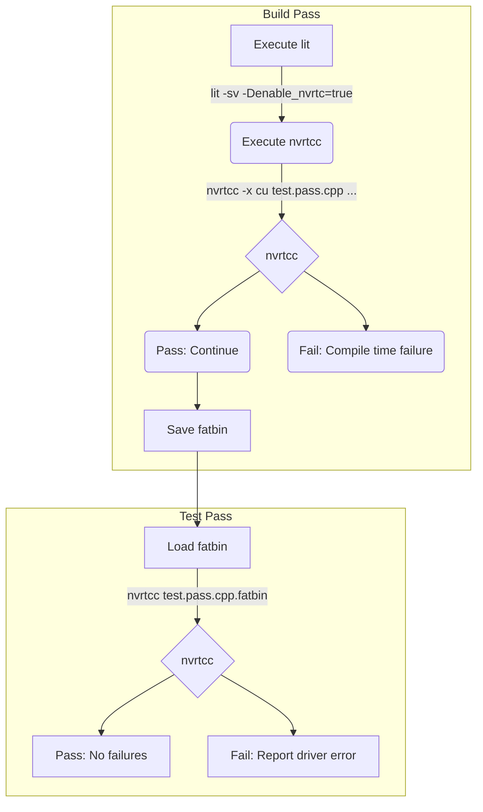

# NVRTCC

## How to use:

Configure libcudacxx to test with NVRTC and `cmake --build` the project before executing `lit`.

```sh
cmake ... -DLIBCUDACXX_TEST_WITH_NVRTC=ON
cmake --build $BUILD_DIR
lit ... $TEST_DIR
```

## How it works

`nvrtcc` processes incoming arguments matching for flags that modify its behavior, and passes the rest to NVRTC.
It will hopefully filter any that don't apply (gcc warnings and such).

The input file is processed to be compatible with NVRTC similarly to the `nvrtc.sh` scripts during compilation.
The resulting file is then compiled with NVRTC and stored as a fatbin. This is, in effect, a compilation pass for NVRTC.
`.fail.cpp` tests will be analyzable by lit and should work properly.

For execution, the fatbin file is provided to nvrtcc again, but will instead launch the precompiled test unit on the GPU.


